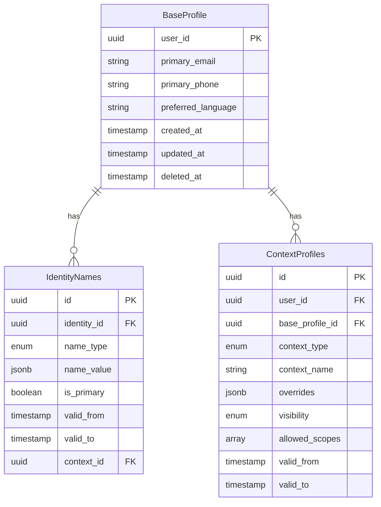
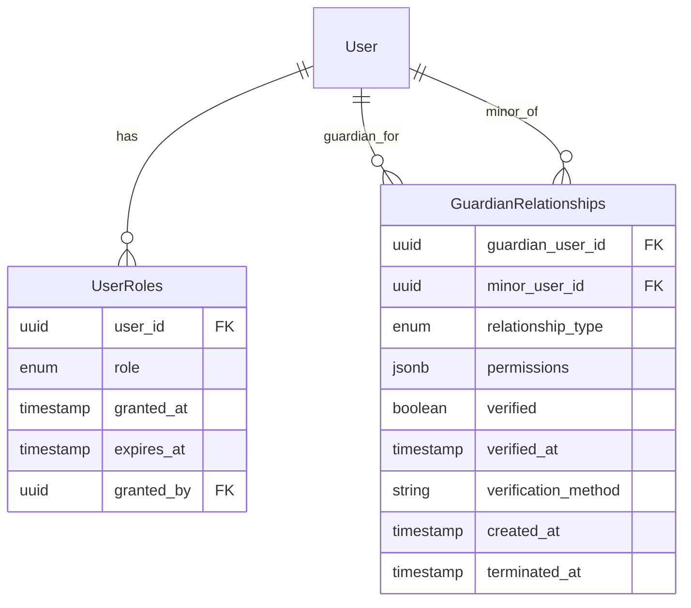
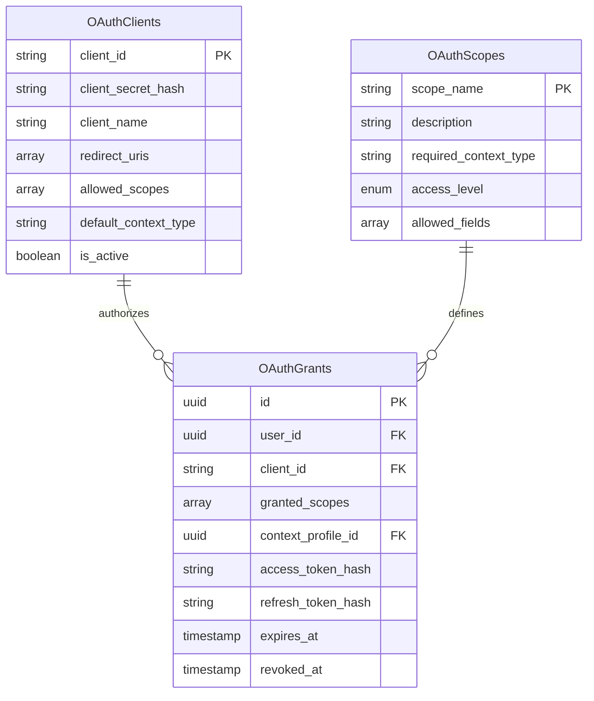
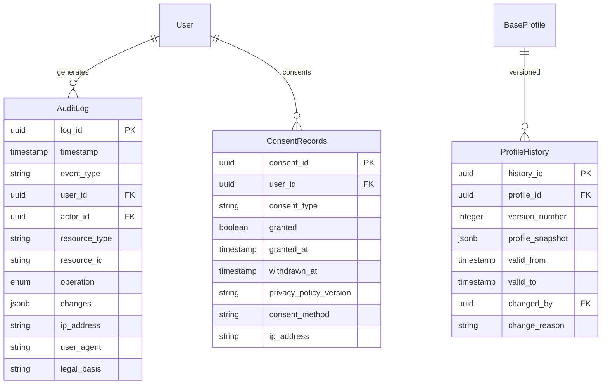

## 4.1 Data Model Philosophy

### Core Principles

1. **Flexible Schema**: Hybrid relational + JSONB for extensibility
2. **Temporal Awareness**: All entities track validity periods
3. **Soft Deletes**: Data marked deleted, not physically removed
4. **Audit Everything**: Complete change history maintained
5. **Normalized Core**: Core entities normalized; extensions flexible
6. **Multilingual Ready**: Text fields support multiple languages

---

## 4.2 Core Domain Model

### Identity Aggregate



### Authorization Aggregate



### OAuth Aggregate



### Audit/Compliance Aggregate



---

## 4.3 Data Storage Strategy

### Primary Data Store: PostgreSQL (Supabase)

**What it stores:**
- Structured data (profiles, relationships, OAuth)
- JSONB for flexible/multilingual fields
- Temporal data with validity periods
- Transactional data requiring ACID

**Why PostgreSQL:**
- Row-Level Security (RLS) for access control
- Strong ACID guarantees
- JSONB support for flexibility
- Excellent query performance
- Mature ecosystem

### Caching Layer: Redis

**What it caches:**
- Session data (user sessions)
- Frequently accessed profiles (5 min TTL)
- Context resolution results (5 min TTL)
- OAuth clients (1 hour TTL)
- User roles (10 min TTL)
- Rate limiting counters

**Cache Invalidation:**
- On profile update -> invalidate profile cache
- On role change -> invalidate role cache
- On OAuth client update -> invalidate client cache

### Audit Log Storage

**Separate from transactional database:**
- Immutable, write-once logs
- Long-term retention (7 years)
- Optimized for append-only writes
- Support compliance queries

### File Storage: Supabase Storage

**What it stores:**
- Profile photos
- Document uploads (verification)
- Data export archives (GDPR)
- Guardian verification documents

---

## 4.4 Data Lifecycle

```
+-------------------------------------------------------------+
|                    Data Lifecycle                           |
+-------------------------------------------------------------+

CREATION
   |
   |-> Profile created (base_profile)
   |-> Consent recorded
   |-> Audit log entry
   |
   v
ACTIVE USE
   |
   |-> Profile updates -> History version created
   |-> Context profiles added -> Inheritance setup
   |-> OAuth grants -> Scope associations
   |
   v
MODIFICATION
   |
   |-> Name changes -> History preserved
   |-> Guardian relationships -> Permissions enforced
   |-> Consent withdrawn -> Processing adjusted
   |
   v
DORMANCY (90 days inactive)
   |
   |-> Flagged for review
   |-> Retained for legal obligations
   |
   v
DELETION REQUEST
   |
   |-> Soft delete (deleted_at timestamp)
   |-> 30-day grace period
   |-> Anonymization of non-essential data
   |-> Retention of audit logs (pseudonymized)
   |
   v
PURGE (after retention period)
   |
   +-> Physical deletion (except audit logs)
```

---

## 4.5 Data Consistency Model

### Strong Consistency (within single aggregate)
- All profile updates within transaction boundary
- ACID guarantees for critical operations
- Read-after-write consistency
- Foreign key constraints enforced

**Example**: Creating profile + assigning role + audit log = single transaction

### Eventual Consistency (across aggregates)
- OAuth grants may lag profile updates
- Audit logs written asynchronously
- Cache invalidation may be delayed

**Example**: OAuth token refresh may see slightly stale profile data

### Temporal Consistency
- All entities have validity periods
- Point-in-time queries supported
- Audit trail enables reconstruction

**Example**: Query "what was this user's name on March 15, 2024?"

---

## 4.6 Indexing Strategy

### Primary Indexes (Unique Constraints)

```sql
-- User profiles
PRIMARY KEY (user_id)
UNIQUE (primary_email) WHERE deleted_at IS NULL

-- Context profiles
PRIMARY KEY (id)
UNIQUE (user_id, context_type, context_name)

-- Guardian relationships
PRIMARY KEY (id)
UNIQUE (guardian_user_id, minor_user_id)

-- OAuth clients
PRIMARY KEY (client_id)

-- OAuth grants
PRIMARY KEY (id)
UNIQUE (user_id, client_id)
```

### Secondary Indexes (Performance)

```sql
-- Frequent lookups
CREATE INDEX idx_profiles_user ON base_profiles(user_id) 
  WHERE deleted_at IS NULL;

CREATE INDEX idx_context_profiles_user ON context_profiles(user_id) 
  WHERE deleted_at IS NULL;

CREATE INDEX idx_guardian_relationships_guardian 
  ON guardian_relationships(guardian_user_id) 
  WHERE terminated_at IS NULL;

CREATE INDEX idx_guardian_relationships_minor 
  ON guardian_relationships(minor_user_id) 
  WHERE terminated_at IS NULL;

-- JSONB indexes
CREATE INDEX idx_profiles_name_gin 
  ON identity_names USING GIN(name_value);

CREATE INDEX idx_context_overrides_gin 
  ON context_profiles USING GIN(overrides);

-- Temporal queries
CREATE INDEX idx_profiles_validity 
  ON base_profiles(valid_from, valid_to);

-- Audit log queries
CREATE INDEX idx_audit_log_user_time 
  ON audit_log(user_id, timestamp DESC);

CREATE INDEX idx_audit_log_resource 
  ON audit_log(resource_type, resource_id);
```

---

## 4.7 Data Retention Policy

| Data Type | Retention Period | Justification |
|-----------|-----------------|---------------|
| **Active Profiles** | While account active + 90 days | Business requirement |
| **Deleted Profiles** | 30 days (soft delete) | Grace period, recovery |
| **Audit Logs** | 7 years | Legal/compliance requirement |
| **OAuth Grants** | While active + 90 days | Security + debugging |
| **Consent Records** | 7 years | Proof of consent (GDPR) |
| **Profile History** | While account active | User transparency |
| **Backups** | 30 days rolling | Disaster recovery |
| **Session Data** | 24 hours | Security best practice |

---

## 4.8 Data Migration Strategy

### Database Schema Migrations (Supabase CLI)

```sql
# Migration file structure
supabase/
|-- migrations/
|   |-- 20240101120000_initial_schema.sql
|   |-- 20240115140000_add_context_profiles.sql
|   |-- 20240201093000_add_guardian_relationships.sql
|   +-- 20240220161500_add_oauth_tables.sql
|-- seed.sql
+-- config.toml
```

**Migration Principles:**
1. Always backward compatible
2. Data migrations separate from schema
3. Rollback scripts for every change
4. Test on staging before production
5. Zero-downtime deployments

---

## 4.9 Backup Strategy

```
+-------------------------------------------------------------+
|                    Backup Strategy                          |
+-------------------------------------------------------------+

Continuous Backups:
   +-> Point-in-time recovery (Supabase built-in)
       +-> Can restore to any point in last 7 days

Daily Full Backups:
   |-> Automated by Supabase
   |-> 30-day retention
   +-> Encrypted at rest

Weekly Archive:
   |-> Export to cold storage
   |-> 1-year retention
   +-> Compliance requirement

Recovery Objectives:
   |-> RPO (Recovery Point Objective): 1 hour
   +-> RTO (Recovery Time Objective): 4 hours
```
