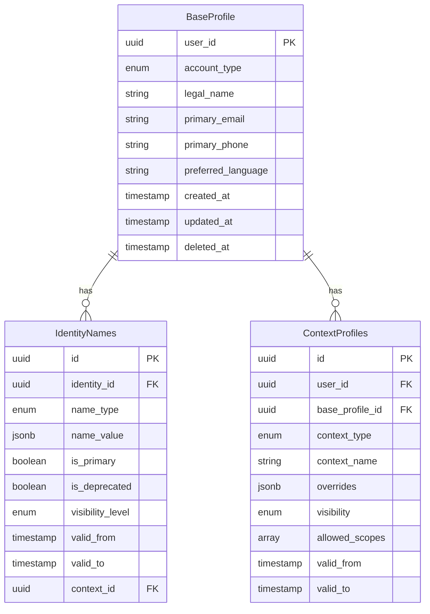
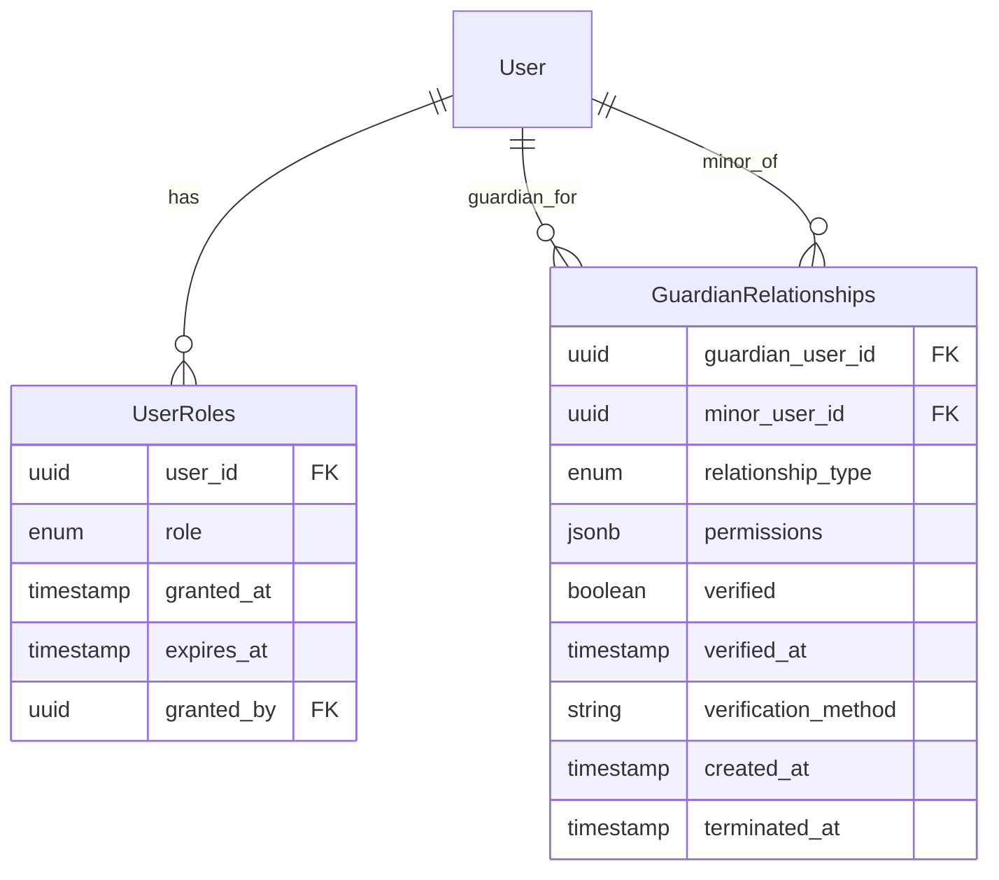
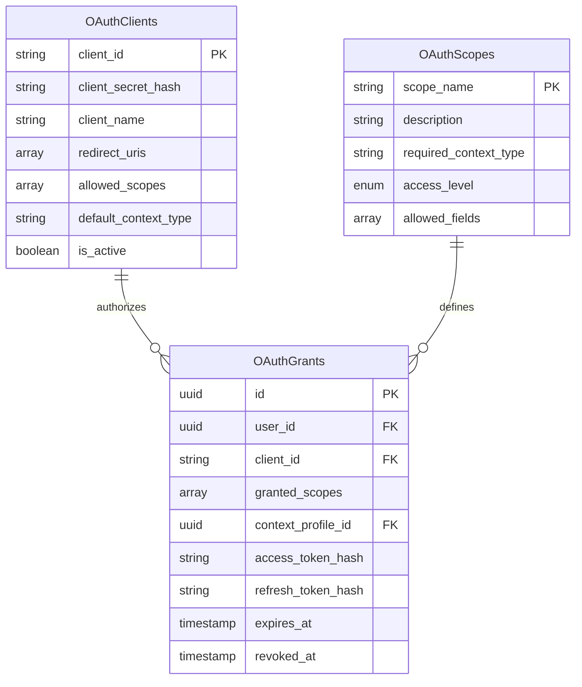
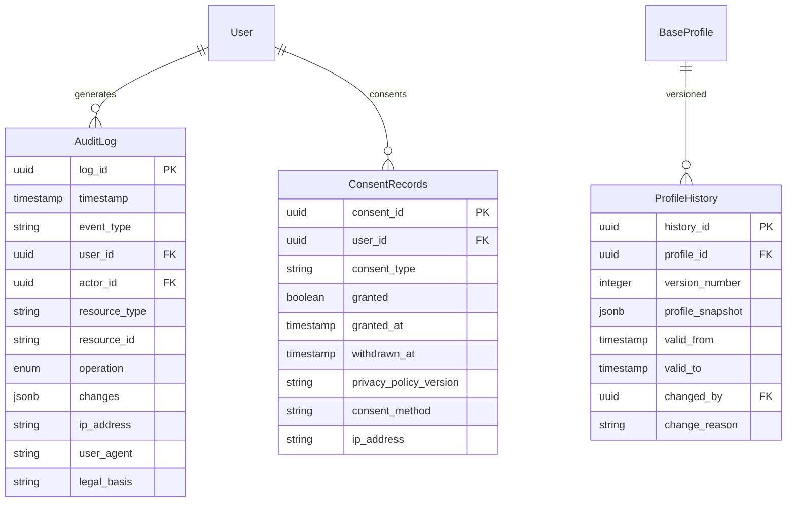

## 4.1 Data Model Philosophy

### Core Principles

1. **Flexible Schema**: Hybrid relational + JSONB for extensibility
2. **Temporal Awareness**: All entities track validity periods
3. **Soft Deletes**: Data marked deleted, not physically removed
4. **Audit Everything**: Complete change history maintained
5. **Normalized Core**: Core entities normalized; extensions flexible
6. **Multilingual Ready**: Text fields support multiple languages

---

## 4.2 Core Domain Model

### Identity Aggregate



**Key Field Notes:**

- **account_type**: Enum (`verified`, `unverified`, `pseudonymous`) - Determines verification level and available features
- **legal_name**: OPTIONAL string - Only required for verified accounts needing legal/healthcare contexts; supports vulnerable populations who cannot safely provide legal identity
- **is_deprecated**: Boolean - Marks names as deprecated (e.g., deadnames) to prevent display in public contexts
- **visibility_level**: Enum (`public`, `private`, `historical_suppressed`) - Controls whether historical names appear in audit logs and API responses

### Authorization Aggregate



### OAuth Aggregate



### Audit/Compliance Aggregate



---

## 4.2a Pseudonymity and Unverified Accounts

### Account Type Categories

The system supports three account types to accommodate diverse user needs and safety requirements:

| Account Type | Legal Name Required | Use Cases | Available Contexts |
|--------------|---------------------|-----------|-------------------|
| **Verified** | Yes (encrypted) | Healthcare, legal services, financial | All contexts including legal, healthcare |
| **Unverified** | No | General social, professional networking | Social, professional, custom (no legal/healthcare) |
| **Pseudonymous** | No | Vulnerable populations requiring anonymity | Social, custom only (highly restricted) |

### Rationale for Pseudonymous Support

Research demonstrates that pseudonymity is essential for vulnerable populations:

- **Transgender youth**: 84% rely on online communities for support (Trevor Project, 2021)
- **Political dissidents**: Protection from authoritarian regimes
- **Domestic violence survivors**: Safety from abusers
- **Marginalized communities**: Safe spaces for identity exploration

### Pseudonymous Account Example

```json
{
  "user_id": "usr_pseudo_789",
  "account_type": "pseudonymous",
  "legal_name": null,
  "preferred_name": "Alex",
  "primary_email": "verified-but-private@protonmail.com",
  "email_visible": false,
  "primary_phone": null,
  "preferred_language": "en",
  "available_contexts": ["social"],
  "restricted_scopes": [
    "profile:read:basic",
    "profile:read:social"
  ]
}
```

### Context Restrictions by Account Type

**Verified Accounts** - Full access:
- Base profile
- Professional contexts
- Social contexts
- Legal contexts (requires legal_name)
- Healthcare contexts (requires legal_name + date_of_birth)

**Unverified Accounts** - Limited access:
- Base profile
- Professional contexts (without credentials verification)
- Social contexts
- Custom contexts
- Cannot access: Legal, Healthcare

**Pseudonymous Accounts** - Minimal access:
- Base profile (minimal fields)
- Social contexts only
- No OAuth integration with verified services
- Cannot access: Professional with credentials, Legal, Healthcare

### Security Implications

**Pseudonymous accounts have:**
- Limited OAuth scopes (basic profile only)
- No cross-context linking
- Enhanced privacy protections
- Restricted third-party integrations
- Cannot be used for age-gated services
- No guardian relationships (requires verification)

**Verification upgrade path:**
- Pseudonymous users can upgrade to unverified by adding contact info
- Unverified users can upgrade to verified through KYC process
- Upgrade preserves existing contexts and data
- Downgrade not permitted (prevents abuse)

### Implementation Notes

**Profile creation flow:**
```python
# Pseudonymous account creation
POST /api/v1/users
{
  "account_type": "pseudonymous",
  "preferred_name": "Alex",
  "primary_email": "alex@protonmail.com",  # Verified but not exposed
  "email_visible": false
}
```

**Context validation:**
```python
# System prevents pseudonymous users from creating restricted contexts
POST /api/v1/users/usr_pseudo_789/contexts
{
  "context_type": "healthcare"  # REJECTED: 403 Forbidden
}

# Error response:
{
  "error": "context_not_allowed",
  "message": "Pseudonymous accounts cannot create healthcare contexts",
  "upgrade_path": "Verify identity to access healthcare contexts"
}
```

---

## 4.2b Cultural Naming Pattern Examples

The system's JSONB-based name storage supports diverse cultural naming conventions without enforcing Western assumptions.

### 1. Mononyms (Indonesian, Icelandic)

**Pattern**: Single name, no family name

**JSONB Structure:**
```json
{
  "names": {
    "full_name": {
      "id": "Sukarno",
      "en": "Sukarno"
    },
    "explanation": "Mononym (single name)"
  }
}
```

**Display Resolution:**
- Display name: "Sukarno"
- Sorting: Alphabetize by full_name
- Formal address: "Sukarno" (no Mr./Ms. prefix unless specified)

**Validation Rules:**
- Do NOT require separate given/family fields
- Accept null for family_name or given_name
- full_name field is sufficient

---

### 2. Chinese Family-First Ordering

**Pattern**: Family name precedes given name

**JSONB Structure:**
```json
{
  "names": {
    "family": {
      "zh": "习",
      "zh-Latn": "Xi",
      "en": "Xi"
    },
    "given": {
      "zh": "近平",
      "zh-Latn": "Jinping", 
      "en": "Jinping"
    },
    "display_order": "family_first",
    "full_name": {
      "zh": "习近平",
      "en": "Xi Jinping"
    }
  }
}
```

**Display Resolution by Language:**
- Chinese (zh-CN): "习近平" (family-first, characters)
- English (en-US): "Xi Jinping" (family-first, romanized)
- Context-aware: May use "Jinping Xi" in Western contexts if user specifies

**Sorting:**
- Chinese locale: Sort by family name (习)
- English locale: Sort by family name (Xi)
- Never assume given name is primary sort key

**Validation Rules:**
- Support both character and romanization forms
- Respect display_order preference
- Allow language-specific ordering overrides

---

### 3. Arabic Multi-Component Names

**Pattern**: Five traditional components (ism, kunya, nasab, laqab, nisba)

**JSONB Structure:**
```json
{
  "names": {
    "ism": {
      "ar": "محمد",
      "ar-Latn": "Muhammad",
      "en": "Muhammad"
    },
    "kunya": {
      "ar": "أبو عبد الله",
      "ar-Latn": "Abu Abdullah",
      "en": "Abu Abdullah"
    },
    "nasab": {
      "ar": "بن عبد الله",
      "ar-Latn": "ibn Abdullah",
      "en": "son of Abdullah"
    },
    "nisba": {
      "ar": "الهاشمي",
      "ar-Latn": "al-Hashimi",
      "en": "al-Hashimi"
    },
    "display_preference": "formal_full"
  }
}
```

**Display Resolution by Context:**
- Formal: "Muhammad ibn Abdullah al-Hashimi"
- Informal: "Muhammad al-Hashimi"
- Very informal: "Abu Abdullah" (kunya)

**Sorting:**
- Primary: ism (given name)
- Secondary: nisba (family/tribal affiliation)

**Validation Rules:**
- All components optional
- No minimum component requirement
- Support Arabic script + romanization
- Respect culturally appropriate abbreviation

---

### 4. Spanish Double Surnames

**Pattern**: Paternal surname + maternal surname

**JSONB Structure:**
```json
{
  "names": {
    "given": {
      "es": "Maria",
      "en": "Maria"
    },
    "paternal_surname": {
      "es": "Garcia",
      "en": "Garcia"
    },
    "maternal_surname": {
      "es": "Rodriguez",
      "en": "Rodriguez"
    },
    "full_name": {
      "es": "Maria Garcia Rodriguez",
      "en": "Maria Garcia Rodriguez"
    },
    "legal_surname_order": ["paternal", "maternal"]
  }
}
```

**Display Resolution:**
- Full formal: "Maria Garcia Rodriguez"
- Common informal: "Maria Garcia"
- Professional: May use both surnames or paternal only per user preference

**Inheritance Rules:**
- Children inherit paternal_surname from father
- Children inherit maternal_surname from mother (her paternal_surname)

**Sorting:**
- Primary: paternal_surname (Garcia)
- Secondary: maternal_surname (Rodriguez)

**Validation Rules:**
- Support separate paternal/maternal fields
- Allow single-surname simplification for international contexts
- Preserve both surnames in legal contexts

---

### 5. Tamil Patronymic Initials

**Pattern**: Father's name initial + given name

**JSONB Structure:**
```json
{
  "names": {
    "patronymic_initial": "S",
    "given": {
      "ta": "ராஜீவ்",
      "ta-Latn": "Rajeev",
      "en": "Rajeev"
    },
    "father_name": {
      "ta": "சுரேஷ்",
      "ta-Latn": "Suresh",
      "en": "Suresh"
    },
    "full_name": {
      "ta": "ச. ராஜீவ்",
      "en": "S. Rajeev"
    },
    "expanded_format": {
      "en": "Suresh's son Rajeev"
    }
  }
}
```

**Display Resolution:**
- Formal: "S. Rajeev"
- International: "Rajeev S." or "Rajeev Suresh"
- Tamil context: "ச. ராஜீவ்" (Tamil script with initial)

**Sorting:**
- Primary: given name (Rajeev)
- Secondary: patronymic initial (S)
- Note: NOT a family surname (changes each generation)

**Validation Rules:**
- Accept single-letter initials
- Support Tamil script + romanization
- Allow expansion of initial to full father's name
- Do not treat initial as "last name"

---

### Cross-Cultural Validation Principles

**What the system DOES:**
- Accept flexible name structures via JSONB
- Support language-specific representations
- Respect cultural ordering preferences
- Allow null for any component

**What the system DOES NOT do:**
- Require "first name" and "last name"
- Assume name ordering
- Force Western name structure
- Mandate minimum name components

**API Design:**
```python
# Good: Flexible structure
POST /api/v1/users/profile
{
  "names": {
    "full_name": {"id": "Sukarno"}  # Valid mononym
  }
}

# Bad: Enforcing structure (NOT USED)
POST /api/v1/users/profile
{
  "first_name": "Sukarno",
  "last_name": "REQUIRED"  # [ERROR] Would reject valid names
}
```

---

## 4.3 Data Storage Strategy

### Primary Data Store: PostgreSQL (Supabase)

**What it stores:**
- Structured data (profiles, relationships, OAuth)
- JSONB for flexible/multilingual fields
- Temporal data with validity periods
- Transactional data requiring ACID

**Why PostgreSQL:**
- Row-Level Security (RLS) for access control
- Strong ACID guarantees
- JSONB support for flexibility
- Excellent query performance
- Mature ecosystem

### Caching Layer: Redis

**What it caches:**
- Session data (user sessions)
- Frequently accessed profiles (5 min TTL)
- Context resolution results (5 min TTL)
- OAuth clients (1 hour TTL)
- User roles (10 min TTL)
- Rate limiting counters

**Cache Invalidation:**
- On profile update -> invalidate profile cache
- On role change -> invalidate role cache
- On OAuth client update -> invalidate client cache

### Audit Log Storage

**Separate from transactional database:**
- Immutable, write-once logs
- Long-term retention (7 years)
- Optimized for append-only writes
- Support compliance queries

### File Storage: Supabase Storage

**What it stores:**
- Profile photos
- Document uploads (verification)
- Data export archives (GDPR)
- Guardian verification documents

---

## 4.4 Data Lifecycle

```
+-------------------------------------------------------------+
|                    Data Lifecycle                           |
+-------------------------------------------------------------+

CREATION
   |
   |-> Profile created (base_profile)
   |-> Consent recorded
   |-> Audit log entry
   |
   v
ACTIVE USE
   |
   |-> Profile updates -> History version created
   |-> Context profiles added -> Inheritance setup
   |-> OAuth grants -> Scope associations
   |
   v
MODIFICATION
   |
   |-> Name changes -> History preserved
   |-> Guardian relationships -> Permissions enforced
   |-> Consent withdrawn -> Processing adjusted
   |
   v
DORMANCY (90 days inactive)
   |
   |-> Flagged for review
   |-> Retained for legal obligations
   |
   v
DELETION REQUEST
   |
   |-> Soft delete (deleted_at timestamp)
   |-> 30-day grace period
   |-> Anonymization of non-essential data
   |-> Retention of audit logs (pseudonymized)
   |
   v
PURGE (after retention period)
   |
   +-> Physical deletion (except audit logs)
```

---

## 4.5 Data Consistency Model

### Strong Consistency (within single aggregate)
- All profile updates within transaction boundary
- ACID guarantees for critical operations
- Read-after-write consistency
- Foreign key constraints enforced

**Example**: Creating profile + assigning role + audit log = single transaction

### Eventual Consistency (across aggregates)
- OAuth grants may lag profile updates
- Audit logs written asynchronously
- Cache invalidation may be delayed

**Example**: OAuth token refresh may see slightly stale profile data

### Temporal Consistency
- All entities have validity periods
- Point-in-time queries supported
- Audit trail enables reconstruction

**Example**: Query "what was this user's name on March 15, 2024?"

---

## 4.6 Indexing Strategy

### Primary Indexes (Unique Constraints)

```sql
-- User profiles
PRIMARY KEY (user_id)
UNIQUE (primary_email) WHERE deleted_at IS NULL

-- Context profiles
PRIMARY KEY (id)
UNIQUE (user_id, context_type, context_name)

-- Guardian relationships
PRIMARY KEY (id)
UNIQUE (guardian_user_id, minor_user_id)

-- OAuth clients
PRIMARY KEY (client_id)

-- OAuth grants
PRIMARY KEY (id)
UNIQUE (user_id, client_id)
```

### Secondary Indexes (Performance)

```sql
-- Frequent lookups
CREATE INDEX idx_profiles_user ON base_profiles(user_id) 
  WHERE deleted_at IS NULL;

CREATE INDEX idx_context_profiles_user ON context_profiles(user_id) 
  WHERE deleted_at IS NULL;

CREATE INDEX idx_guardian_relationships_guardian 
  ON guardian_relationships(guardian_user_id) 
  WHERE terminated_at IS NULL;

CREATE INDEX idx_guardian_relationships_minor 
  ON guardian_relationships(minor_user_id) 
  WHERE terminated_at IS NULL;

-- JSONB indexes
CREATE INDEX idx_profiles_name_gin 
  ON identity_names USING GIN(name_value);

CREATE INDEX idx_context_overrides_gin 
  ON context_profiles USING GIN(overrides);

-- Temporal queries
CREATE INDEX idx_profiles_validity 
  ON base_profiles(valid_from, valid_to);

-- Audit log queries
CREATE INDEX idx_audit_log_user_time 
  ON audit_log(user_id, timestamp DESC);

CREATE INDEX idx_audit_log_resource 
  ON audit_log(resource_type, resource_id);
```

---

## 4.7 Data Retention Policy

| Data Type | Retention Period | Justification |
|-----------|-----------------|---------------|
| **Active Profiles** | While account active + 90 days | Business requirement |
| **Deleted Profiles** | 30 days (soft delete) | Grace period, recovery |
| **Audit Logs** | 7 years | Legal/compliance requirement |
| **OAuth Grants** | While active + 90 days | Security + debugging |
| **Consent Records** | 7 years | Proof of consent (GDPR) |
| **Profile History** | While account active | User transparency |
| **Backups** | 30 days rolling | Disaster recovery |
| **Session Data** | 24 hours | Security best practice |

---

## 4.8 Data Migration Strategy

### Database Schema Migrations (Supabase CLI)

```sql
# Migration file structure
supabase/
|-- migrations/
|   |-- 20240101120000_initial_schema.sql
|   |-- 20240115140000_add_context_profiles.sql
|   |-- 20240201093000_add_guardian_relationships.sql
|   +-- 20240220161500_add_oauth_tables.sql
|-- seed.sql
+-- config.toml
```

**Migration Principles:**
1. Always backward compatible
2. Data migrations separate from schema
3. Rollback scripts for every change
4. Test on staging before production
5. Zero-downtime deployments

---

## 4.9 Backup Strategy

```
+-------------------------------------------------------------+
|                    Backup Strategy                          |
+-------------------------------------------------------------+

Continuous Backups:
   +-> Point-in-time recovery (Supabase built-in)
       +-> Can restore to any point in last 7 days

Daily Full Backups:
   |-> Automated by Supabase
   |-> 30-day retention
   +-> Encrypted at rest

Weekly Archive:
   |-> Export to cold storage
   |-> 1-year retention
   +-> Compliance requirement

Recovery Objectives:
   |-> RPO (Recovery Point Objective): 1 hour
   +-> RTO (Recovery Time Objective): 4 hours
```
