## 5.1 Security Layers (Defense in Depth)

```mermaid
graph TB
    Request[Incoming Request] --> L1
    
    subgraph L1["Layer 1: Network Security"]
        Firewall[Firewall Rules]
        DDoS[DDoS Protection]
        IP[IP Allowlisting]
    end
    
    subgraph L2["Layer 2: Transport Security"]
        TLS[TLS 1.3]
        Cert[Certificate Validation]
        HSTS[HSTS Headers]
    end
    
    subgraph L3["Layer 3: Authentication"]
        JWT[JWT Token Validation]
        OAuth[OAuth 2.0 Flows]
        MFA[Multi-Factor Auth]
        Session[Session Management]
    end
    
    subgraph L4["Layer 4: Authorization"]
        Scopes[OAuth 2.0 Scopes]
        RBAC[Role-Based Access Control]
        ABAC[Attribute-Based Access Control]
        RLS[Row-Level Security]
    end
    
    subgraph L5["Layer 5: API Security"]
        RateLimit[Rate Limiting]
        APIKey[API Key Validation]
        Signing[Request Signing]
        CORS[CORS Policies]
    end
    
    subgraph L6["Layer 6: Application Security"]
        InputVal[Input Validation]
        OutputEnc[Output Encoding]
        SQLPrev[SQL Injection Prevention]
        XSSPrev[XSS Prevention]
    end
    
    subgraph L7["Layer 7: Monitoring"]
        IDS[Intrusion Detection]
        Anomaly[Anomaly Detection]
        Audit[Security Audit Reviews]
    end
    
    L1 --> L2
    L2 --> L3
    L3 --> L4
    L4 --> L5
    L5 --> L6
    L6 --> L7
    L7 --> Response[Secure Response]
    
    style L1 fill:#ffebee
    style L2 fill:#fce4ec
    style L3 fill:#f3e5f5
    style L4 fill:#ede7f6
    style L5 fill:#e8eaf6
    style L6 fill:#e3f2fd
    style L7 fill:#e0f2f1
    style Request fill:#fff3e0
    style Response fill:#e8f5e9
```



---

## 5.2 Authentication Architecture

### JWT Token Strategy

```
User Authentication Flow:
   |
   |-> Supabase Auth Issues JWT
   |   |-> Access token (1 hour expiry)
   |   +-> Refresh token (30 days expiry)
   |
   |-> Access Token Contains:
   |   |-> sub (user_id)
   |   |-> email
   |   |-> aud (audience)
   |   |-> exp (expiration)
   |   +-> Custom claims (roles)
   |
   +-> API validates token on each request
       |-> Verify signature
       |-> Check expiration
       |-> Validate audience
       +-> Extract user context
```

### OAuth 2.0 Token Flow

```
Authorization Code Flow:
   |
   |-> User authorizes third-party app
   |-> System issues authorization code
   |-> Third-party exchanges code for tokens
   |
   +-> Access Token Contains:
       |-> user_id
       |-> client_id
       |-> granted_scopes
       +-> context_profile_id
```

---

## 5.3 Authorization Architecture

### Multi-Level Authorization

```
Request with Token
   |
   |-> Layer 1: Authentication Check
   |   +-> Is token valid and not expired?
   |
   |-> Layer 2: Role-Based Check (RBAC)
   |   +-> Does user have required role?
   |
   |-> Layer 3: Attribute-Based Check (ABAC)
   |   +-> Context-specific rules
   |
   |-> Layer 4: Scope-Based Check (OAuth)
   |   +-> Does token have required scope?
   |
   +-> Layer 5: Row-Level Security (RLS)
       +-> Database-enforced policies
```

### Authorization Patterns

| Pattern | Use Case | Example |
|---------|----------|---------|
| **Resource Owner** | User accesses own data | `user_id == current_user.id` |
| **Role-Based** | Admin access | `'admin' IN current_user.roles` |
| **Relationship-Based** | Guardian access | `guardian_of(current_user, target_user)` |
| **Scope-Based** | OAuth client access | `required_scope IN token.scopes` |
| **Context-Based** | Profile visibility | `profile.is_public OR user_authorized` |

---

## 5.4 Data Protection

### Encryption Strategy

```
Data in Transit:
   +-> TLS 1.3
       |-> Strong cipher suites
       |-> Certificate validation
       +-> HSTS enforced

Data at Rest:
   |-> Database encryption (TDE)
   |-> Field-level encryption (sensitive)
   |   |-> Legal names (AES-256-GCM)
   |   +-> Date of birth
   +-> Backup encryption

Password Hashing:
   +-> bcrypt or Argon2id
       |-> Work factor: 12+ rounds
       +-> Salt per password
```

### Sensitive Data Classification

| Data Type | Classification | Protection |
|-----------|---------------|------------|
| Legal Name | Highly Sensitive | Encrypted + access logged |
| Date of Birth | Sensitive | Encrypted + age only exposed |
| Email | Sensitive | TLS only + masked in logs |
| Preferred Name | Public | User-controlled visibility |
| Pronouns | Public | No special protection |

---

## 5.5 Security Controls

### Input Validation
- Schema validation (Pydantic)
- Length limits enforced
- Character set restrictions
- Parameterized queries (SQL injection prevention)
- Output encoding (XSS prevention)

### Rate Limiting

| Endpoint Type | Rate Limit | Window |
|--------------|------------|--------|
| Authentication | 5 requests | Per minute |
| OAuth token | 10 requests | Per minute |
| Profile read | 100 requests | Per minute |
| Profile write | 30 requests | Per minute |
| Admin operations | 60 requests | Per minute |

### Security Headers
```
X-Frame-Options: DENY
X-Content-Type-Options: nosniff
Strict-Transport-Security: max-age=31536000; includeSubDomains
Content-Security-Policy: default-src 'self'
X-XSS-Protection: 1; mode=block
```

---

## 5.6 OWASP Top 10 Mitigations

| Vulnerability | Mitigation |
|--------------|------------|
| **Broken Access Control** | RLS + authorization checks in every endpoint |
| **Cryptographic Failures** | TLS 1.3 + AES-256 + proper key management |
| **Injection** | Parameterized queries + input validation |
| **Insecure Design** | Security by design + threat modeling |
| **Security Misconfiguration** | Secure defaults + automated scanning |
| **Vulnerable Components** | Dependency scanning + regular updates |
| **Authentication Failures** | MFA + strong password policy + rate limiting |
| **Data Integrity Failures** | Code signing + integrity checks |
| **Logging Failures** | Comprehensive audit logs + monitoring |
| **SSRF** | Input validation + network segmentation |

---

## 5.7 Audit Logging

### What Gets Logged

```
Every operation logs:
   |-> Who (user_id, actor_id)
   |-> What (operation, resource)
   |-> When (timestamp)
   |-> Where (IP address, user agent)
   |-> Why (legal basis, GDPR article)
   +-> Changes (before/after state)
```

### Audit Log Requirements
- **Immutable**: Write-once storage
- **Encrypted**: At rest
- **Access-controlled**: Audit team only
- **Retained**: 7 years minimum
- **Tamper-evident**: Hash chaining
