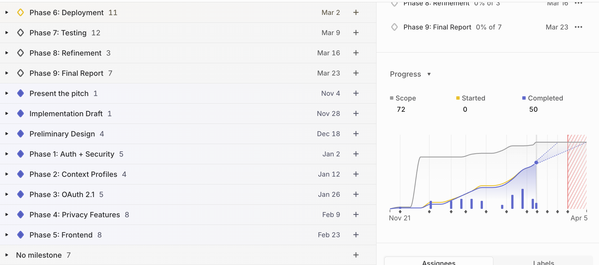
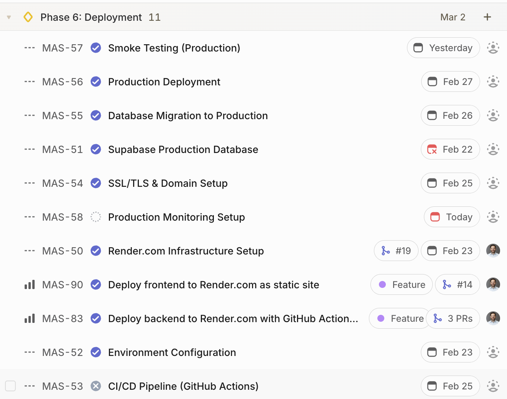
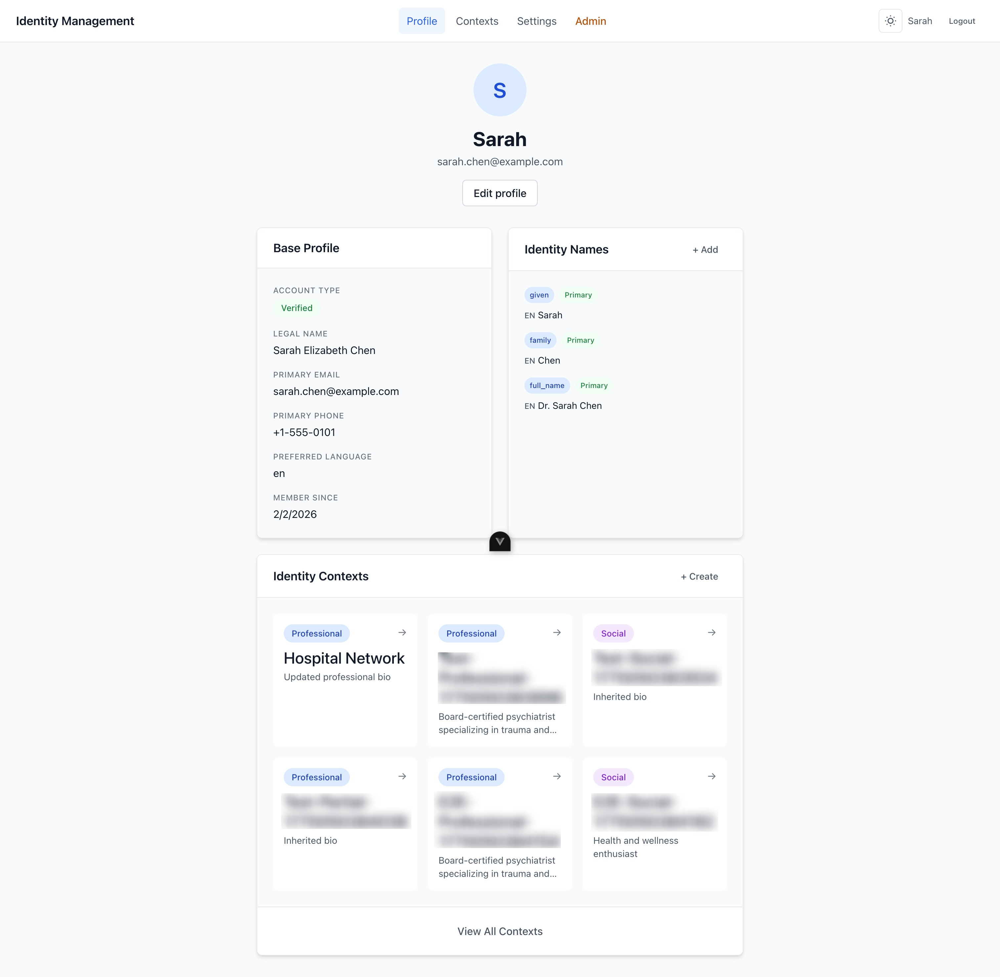
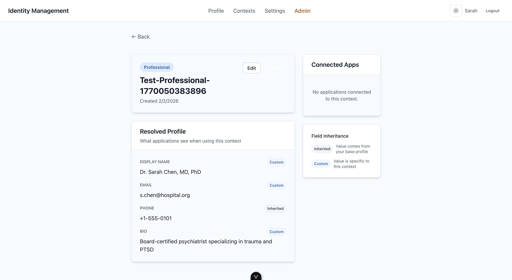

\newpage

# Introduction {#sec-introduction}

## Project Concept

Modern identity systems get authentication right but identity wrong. They can verify who you are, but they cannot represent that you go by "Dr. Smith" at work, "Sarah" with friends, and your Chinese name with family. They assume names follow Western conventions, that people have one fixed identity, and that privacy means hiding information rather than controlling how it flows.

This project implements a context-aware identity and profile management API that addresses a fundamental architectural gap in contemporary identity systems. The system treats identity as contextual, culturally diverse, and user-controlled rather than singular, Western-centric, and administratively fixed.

The implementation follows project template 7.1, "Identity and profile management API," from CM3035 Advanced Web Design [@cipriani2025pitch]. The template focuses on RESTful API design, secure authentication and authorization, database modeling for complex domain requirements, and third-party integration via OAuth 2.1. The final deliverable consists of a fully functional backend API with a demonstration frontend deployed to production infrastructure.

## Problem Motivation

Every human identity system designer eventually discovers the same uncomfortable truth: names are not data fields. They are complex, culturally-embedded, historically-contingent, socially-negotiated aspects of human identity that resist standardization [@mckenzie2010falsehoods].

Contemporary identity management systems enforce a singular identity paradigm that fundamentally conflicts with how humans actually use identity across contexts, cultures, and lifecycles. This creates five interconnected problems.

First, human identity is performative and context-dependent. People naturally present different facets depending on context: professional names at work, preferred names with friends, legal names with government, and pseudonyms for safety or exploration [@goffman1959presentation; @marwick2011tweet]. Yet systems enforce singular representations, creating context collapse with documented harms.

Second, cultural naming diversity defies standardization. Billions of people have names that do not fit Western "first name + last name" assumptions [@mckenzie2010falsehoods; @w3c2023personal]. Chinese surname-first, Arabic five-component names, Icelandic patronymics, Spanish double surnames, and South Indian initials are not edge cases - they represent how most of the world's population structures names.

Third, identity lifecycle includes legitimate changes. Marriage, gender transition, professional development, and safety needs create valid reasons for name changes [@trevorproject2021]. Systems treating changes as exceptional errors cause systematic harm - transgender youth who can change legal names have significantly lower suicide attempt rates.

Fourth, privacy requires context-aware disclosure. Users need to present different information to different audiences (employers, family, social networks, healthcare providers, third-party applications), but current systems force universal disclosure or universal hiding with no context-aware middle ground.

Fifth, safety demands pseudonymity and separation. Marginalized groups (transgender individuals, domestic abuse survivors, political dissidents, LGBTQ+ youth) require pseudonymity and context separation for safety [@haimson2016authenticself], yet real-name policies and singular identity enforcement systematically exclude and endanger them.

The measurable impact is substantial. 90% of enterprises experienced identity-related security incidents in 2024 [@idsa2024report], often because rigid systems drove users to insecure workarounds. 71% of young adults modify privacy settings to manage context collapse [@pew2010reputation].

## Project Scope

The scope includes multi-context identity profile management with an inheritance engine, an OAuth 2.1 authorization server with mandatory PKCE, GDPR-inspired privacy features including data export and deletion with 30-day grace periods, multilingual name support accommodating global conventions via JSONB storage, comprehensive audit logging for transparency and accountability, profile picture management with context-specific overrides, identity document upload for account verification enabling access to legal and healthcare contexts, and a CI/CD pipeline with static analysis enforcing code quality and security standards.

Explicitly excluded from scope are full legal GDPR/CCPA compliance certification (which requires legal counsel and organizational governance beyond academic scope), non-human identity management for service accounts and API keys, blockchain-based decentralized identity solutions, and biometric authentication mechanisms. An earlier iteration of the project included a guardian relationship system for managing identities of minors and dependents. Tutor feedback on the preliminary submission [@cipriani2026preliminary] identified this subsystem as disproportionately complex relative to the project's core contribution, and it was removed from scope to allow deeper treatment of the context-aware identity and OAuth features that constitute the primary research focus.

Privacy-by-design principles inspired by GDPR, CCPA, and HIPAA guide the architecture. However, this is not a legally compliant implementation. Full regulatory compliance requires legal counsel, Data Protection Impact Assessments, formal breach notification processes, and organizational governance beyond the scope of this academic thesis.

## Why Existing Solutions Fail

Current identity solutions optimize for different dimensions while sacrificing others. Google Identity Platform and Microsoft Entra ID provide sophisticated authentication but maintain fundamentally singular identity per user with no native support for context-dependent presentation. Apple's Sign in with Apple prioritizes hiding information rather than flexible identity expression. Facebook's real-name policy evolution demonstrates persistent tension between platform tracking needs and user identity flexibility [@haimson2016authenticself]. LinkedIn requires professional names only, with no support for separate personal identity or cultural naming variations.

Authentication and security have matured, but no existing solution combines user-controlled context-dependent identity presentation, cultural neutrality without structural assumptions, privacy compliance with user agency, and usability appropriate for general users. This gap defines the project's intended contribution.

\newpage

# Literature Review {#sec-literature}

The background research report [@cipriani2025background] identified three bodies of literature that establish the foundation for context-aware identity management. Technical standards from W3C and Unicode document global naming diversity that Western systems cannot accommodate. Sociological research from Goffman through contemporary social media studies demonstrates that context-dependent identity presentation is a fundamental human need, not a pathology. Privacy regulations like GDPR and security frameworks from NIST establish that users must control their own data with transparent processing.

## The Technical and Cultural Challenge of Names

The fundamental assumption underlying most identity systems, that names consist of a "first name" and "last name", fails immediately when examined against global naming practices.

### Foundational Critique

Patrick McKenzie's influential 2010 blog post "Falsehoods Programmers Believe About Names" [@mckenzie2010falsehoods] catalogs over 40 incorrect assumptions that pervade identity system design. Among these falsehoods are the beliefs that people have exactly one canonical name, that names fit within a reasonable length, that names can be represented in ASCII characters, and that names remain constant throughout a person's life. McKenzie concludes that he has never encountered a computer system that handles names properly and doubts one exists anywhere.

Despite its informal origin, fourteen years of extensive citation in technical literature and alignment with subsequent W3C standards work establish this source as credible documentation of oversimplified assumptions in identity system design.

### Standards-Based Guidance

The W3C Internationalization Activity provides authoritative technical guidance through "Personal names around the world" [@w3c2023personal], a continuously updated resource documenting global naming conventions. As the primary international standards organization for the web, the W3C represents a credible source for technical implementation decisions.

The W3C guidance documents specific challenges that arise from cultural variation. Chinese naming conventions place the family name first, directly opposite to Western practice. Arabic naming traditionally includes five components: the ism (given name), kunya (parent-of-X), nasab (chain of ancestors), laqab (descriptive epithet), and nisba (geographic origin). Spanish and Latin American conventions employ two surnames derived from each parent. Icelandic naming is purely patronymic with no hereditary surnames, meaning siblings and parent-child pairs do not share family names. South Indian Tamil naming uses initials derived from the father's given name as a prefix.

These patterns represent the naming conventions of billions of people whose identities cannot be accurately represented in systems assuming Western structure. The W3C recommends avoiding rigid field structures, using single fields for full names where possible, ensuring fields accommodate names of any length, and preserving user-entered casing. The guidance emphasizes that systems should not attempt to parse names into components algorithmically, as the rules governing name structure vary not only between cultures but sometimes between individuals within the same culture.

The Unicode Consortium's Technical Report 35 [@unicode2024personnames] extends this guidance with a formal specification for name formatting across locales. The specification defines seven core fields (title, given, given2, surname, surname2, generation, credentials) with formatting patterns based on order, length, usage, and formality. The specification addresses presentation concerns, enabling applications to format names appropriately for different contexts such as formal correspondence versus casual display. However, the specification explicitly notes that parsing names into components, handling special protocols for royalty or religious figures, and managing context-dependent variations remain out of scope. Even comprehensive international standards do not address the need for users to present different names in different social contexts.

### Synthesis for System Design

Together, these sources reveal a fundamental tension. McKenzie identifies what systems get wrong; W3C and Unicode provide partial solutions for formatting and storage; but none address context-dependent identity presentation. A person may legitimately maintain different names in different contexts, and no existing standard addresses this requirement.

This analysis informs the project's design decision to use JSONB storage for multilingual name representation without imposing structural assumptions. Rather than fields for "first name" and "last name," the system stores name values keyed by language code with separate name type indicators for given, family, preferred, and legal names. This approach accommodates cultural diversity while enabling context-specific name presentation.

## Identity Theory and Context Collapse

The sociological literature provides theoretical foundations for understanding why singular identity systems cause harm.

### Theoretical Foundation

Erving Goffman's *The Presentation of Self in Everyday Life* [@goffman1959presentation] established the dramaturgical metaphor for understanding human identity. Goffman argued that identity is performative rather than fixed, people play different roles depending on audience and context, managing impressions through "front stage" presentations while maintaining "back stage" regions where they can relax their performance.

This 1959 work predates digital technology but proves prescient for contemporary identity challenges. Goffman observed that humans naturally maintain bounded social contexts: individuals are rarely simultaneously visible to coworkers, family members, romantic partners, and casual acquaintances. Each context calls forth different aspects of identity, and the boundaries between contexts enable authentic self-presentation within each domain. The key insight is that maintaining different presentations is not deception but rather a fundamental aspect of social competence. A physician who speaks differently to patients, colleagues, and family members is not being dishonest but rather adapting appropriately to social context.

In print for over sixty-five years with extensive citations across human-computer interaction, communication studies, and identity management research, Goffman's framework explains why forcing users into singular identity representations creates systematic harm.

### Digital Context and Social Media

Marwick and boyd's 2011 study "I Tweet Honestly, I Tweet Passionately: Twitter Users, Context Collapse, and the Imagined Audience" [@marwick2011tweet] applied Goffman's framework to digital platforms. Published in New Media & Society, a peer-reviewed Sage journal, this research introduced the term "context collapse" to describe how social media merges previously discrete audiences into single spaces.

The researchers documented how Twitter users navigate the tension between authentic self-expression and awareness of diverse audiences. Unlike face-to-face interaction where environmental cues signal appropriate presentation, social media posts become simultaneously visible to professional contacts, family members, friends, and strangers. Users respond through self-censorship, strategic ambiguity, and lowest-common-denominator content.

Mark Zuckerberg predicted this merging of contexts would normalize. The research demonstrates this prediction was incorrect. Rather than accepting singular identity, users actively resist through elaborate coping strategies: creating secondary accounts for close friends, segmenting platforms by audience type, and aggressively managing privacy settings. Survey data indicates that 71% of social networking users ages 18-29 have modified privacy settings [@pew2010reputation], with 47% deleting unwanted comments and 41% removing their names from tagged photos.

### Contemporary Extension

Loh and Walsh's 2021 article "Social Media Context Collapse: The Consequential Differences Between Context Collusion Versus Context Collision" [@loh2021contextcollapse] extended the framework by distinguishing between intentional and unintentional context collapse. Published in Social Media + Society, this peer-reviewed research identifies two distinct phenomena. Context collusion occurs when users intentionally merge contexts. Context collision occurs when contexts merge unexpectedly, such as when a post intended for friends reaches employers through shared connections.

Both phenomena create challenges, but collision produces more significant harm because users cannot anticipate or control it. The research documented that context collapse affects emotional expression, professional reputation, and identity performance, with network size and heterogeneity correlating to increased self-presentation challenges. Users with larger and more diverse social networks experienced greater difficulty maintaining coherent self-presentation, suggesting that the problem intensifies as digital social connectivity increases.

### Implications for Architecture

The progression from Goffman through Marwick and boyd to Loh and Walsh establishes that context-dependent identity presentation is not merely a preference but a fundamental human need. Systems forcing singular identity create documented harms including reduced authenticity, self-censorship, exposure to unintended audiences, professional damage, and relationship strain.

This literature directly informs the project's multi-context architecture. Rather than maintaining a single profile, users can create context profiles for professional, social, legal, healthcare, family, and custom purposes, each inheriting from a base profile while overriding specific fields. OAuth scopes control which context is presented to which third-party application, enabling the bounded contexts that humans naturally maintain offline to be recreated in digital systems. The architecture treats context separation as a feature rather than a problem to be solved, aligning system design with documented human social behavior rather than forcing users to adapt to technical constraints.

## Privacy Regulations and Security Requirements

Any identity system must operate within regulatory frameworks governing personal data.

### Rights-Based Framework

The General Data Protection Regulation [@gdpr2016], effective since 2018, establishes data subject rights that directly impact identity system design. As binding EU legislation, this represents an authoritative legal source.

Article 16 establishes the right to rectification, requiring that data subjects be able to correct inaccurate personal data without undue delay. When names change through marriage, transition, or other life events, systems must support updates across all data holdings while maintaining historical records for compliance purposes. Article 5(1)(c) mandates data minimization, requiring systems to collect only data that is adequate, relevant, and necessary for specified purposes. This principle suggests using context-scoped access rather than universal disclosure, as applications should receive only the identity information required for their specific function. Articles 15, 17, and 20 establish rights to access, erasure, and portability, requiring systems to export user data in machine-readable formats and delete data upon request within defined timeframes.

Article 7(3) addresses consent withdrawal, requiring that it be as easy to withdraw consent as to give it. For identity systems with third-party integrations, this means users must be able to revoke application access to their identity data at any time. The project implements these principles architecturally: processing basis is recorded for every operation, audit trails track data access, consent management enables granular withdrawal, and export/delete endpoints implement data subject rights. However, full GDPR compliance requires legal counsel, Data Protection Impact Assessments, and organizational processes beyond academic scope.

### Risk-Based Security

NIST Special Publication 800-63-3 [@nist2017digital] provides technical guidance for digital identity from a security perspective. As U.S. federal government publication, this represents authoritative security guidance widely adopted across industries.

NIST establishes identity assurance levels, authenticator assurance levels, and federation assurance levels based on risk assessment. Key recommendations include minimum 8-character passwords without arbitrary composition rules, blocking of passwords known to be breached, multi-factor authentication for sensitive operations, password storage using Argon2, bcrypt, or PBKDF2, and session management with high-entropy identifiers. These requirements establish baseline security expectations that the project incorporates.

### Intersection with Identity Dignity

Haimson and Hoffmann's 2016 study "Constructing and enforcing 'authentic' identity online: Facebook, real names, and non-normative identities" [@haimson2016authenticself] examines how identity policies affect marginalized users. Published in First Monday, this peer-reviewed research documented how Facebook's real-name policy systematically harmed transgender individuals, drag performers, domestic abuse survivors, and Native Americans.

The research found that real-name policies "simultaneously demand authenticity yet proscribe certain people from authentic self-presentation," creating a double bind. Transgender individuals forced to use deadnames experience documented psychological harm. The Trevor Project survey [@trevorproject2021] found that transgender youth who changed their legal names reported significantly lower suicide attempt rates, directly linking proper name support to mental health outcomes.

### Converging Requirements

GDPR (rights-based) and NIST (risk-based) frameworks converge on user control as a requirement. GDPR mandates that users can correct and delete their data; NIST emphasizes informed consent and transparency. Both frameworks support the project's approach of recording processing basis, maintaining audit trails, and implementing data export capabilities.

The deadname protection requirement emerges from the intersection of privacy rights (GDPR Article 16), security needs (preventing harmful information disclosure), and human dignity (supporting authentic self-presentation). The project implements this through visibility controls on name records, with a "historical_suppressed" visibility level that maintains records for audit purposes while preventing display to unauthorized parties. This approach satisfies competing requirements: audit compliance demands historical accuracy while user safety demands protection from disclosure of deprecated identifying information.

## Critical Evaluation of Existing Solutions

To position the project within the current landscape, this section evaluates five categories of identity management solutions against requirements derived from the literature: context support, cultural flexibility, privacy compliance, and usability. @tbl-comparison summarizes this comparison across major platforms.

| Platform | Context Support | Cultural Names | Pseudonymity | OAuth/OIDC | Open Source |
|----------|----------------|----------------|--------------|------------|-------------|
| Google Identity | No | Limited | No | Full | No |
| Microsoft Entra | No | Limited | No | Full | No |
| Apple Sign In | No | Limited | Partial | OIDC | No |
| Auth0/Okta | Custom only | Flexible | Yes | Full | No |
| Keycloak | Partial | Flexible | Yes | Full | Yes |
| **This Project** | **Native** | **Native** | **Full** | **OAuth 2.1** | **Yes** |

: Identity Platform Comparison {#tbl-comparison}

Google Identity Platform excels at authentication with familiar OAuth flows but provides only one displayName across all services. Custom attributes require Workspace administration and cannot be user-controlled per context. Microsoft Entra ID offers sophisticated Conditional Access for security decisions based on location, device, and risk level, but this context awareness controls access rather than identity presentation. Users cannot maintain different professional versus personal identities within the same account.

Apple's Sign in with Apple takes a privacy-first approach, generating unique relay email addresses per application. However, the focus remains on hiding information rather than enabling flexible expression. SCIM [@rfc7643] and OpenID Connect [@openidconnect2014] provide industry-standard protocols for identity provisioning and authentication with structured name fields, but offer no support for context-specific names, cultural variations beyond basic Western structure, or user-controlled presentation preferences.

Self-Sovereign Identity approaches, including W3C Verifiable Credentials and platforms built on Hyperledger Indy, promise user control through decentralization. However, usability research from SOUPS 2022 [@soups2022didm] found these systems "too sophisticated for average users." Participants expected automatic backups but did not realize they bore sole responsibility for key management. When asked about recovery scenarios, users expressed surprise that losing their device could mean permanent loss of their identity credentials. The complexity creates burden rather than empowerment for typical users who expect the convenience of centralized recovery mechanisms.

The comparison reveals a consistent pattern: existing solutions optimize for one dimension while sacrificing others. Centralized platforms achieve high usability but enforce singular identity. Standards enable interoperability but assume Western name structures. Decentralized approaches offer theoretical flexibility but fail on usability. No existing solution combines user-controlled context-dependent identity presentation, cultural neutrality without structural assumptions, privacy compliance with user agency, and usability appropriate for general users.

\newpage

# Design {#sec-design}

## Problem Formulation and Theoretical Foundation

The design presented in the preliminary report [@cipriani2026preliminary] addresses the architectural gap identified in the background research [@cipriani2025background]. Contemporary identity management systems enforce singular, culturally-biased identity models that fail to accommodate human identity presentation across contexts. The design applies Goffman's dramaturgical theory [@goffman1959presentation], positing that identity is performative rather than essential. Digital platforms forcing singular identity models result in self-censorship and documented harm to marginalized populations [@haimson2016authenticself].

The multi-context architecture derives directly from the sociological literature on identity presentation. Goffman's framework establishes that humans naturally maintain bounded social contexts, presenting different aspects of identity to different audiences. Marwick and boyd [@marwick2011tweet] documented how digital platforms create "context collapse" that forces users to navigate tensions between authentic self-expression and awareness of diverse audiences. The architecture recreates bounded contexts through context profiles inheriting from base profiles while overriding specific fields. OAuth tokens bind to specific contexts, ensuring context-appropriate data access.

## Domain and User Requirements

The identity management domain presents the challenge of managing multiple identity presentations across different life contexts. The W3C [@w3c2023personal] documents how global naming conventions cannot be accurately represented in systems assuming Western structure, affecting billions of users whose names do not fit "first name, last name" fields.

Four personas inform requirements. A privacy-focused professional (psychiatrist) requires different identity presentations for different applications: credentials for healthcare platforms while concealing professional information from fitness apps. The solution enables context-specific OAuth tokens bound to identity contexts.

A multilingual user (Chinese engineer) requires culturally-appropriate name display: "Li Ming" in Western contexts, "李明" in Chinese contexts. The solution stores names as JSONB with language keys, resolving via Accept-Language headers.

A vulnerable population member (transgender individual) requires preferred name usage without exposing deprecated names. Research [@trevorproject2021] correlates proper name support with reduced suicide attempts. The solution provides pseudonymous accounts with automatic suppression of deprecated names.

A career transitioner requires both current professional identity and legacy identity for reference verification. The solution supports multiple context profiles with temporal validity enabling historical queries.

## System Architecture

The system follows five-layer architecture: presentation (FastAPI REST endpoints), application (business logic services), domain (models and aggregates), data access (repository pattern), and infrastructure (PostgreSQL, Redis, external services). This enables independent layer testing, downward dependency flow, and domain-infrastructure separation.

```{mermaid}
%%| label: fig-layered-arch
%%| fig-cap: "Five-layer system architecture"
%%| fig-width: 6
graph TD
    subgraph PL["Presentation Layer"]
        IE[Identity Endpoints]
        OE[OAuth Endpoints]
        PE[Privacy Endpoints]
        VE[Verification Endpoints]
    end

    subgraph AL["Application Layer"]
        PS[Profile Service]
        CS[Context Service]
        AS[Auth Service]
        OS[OAuth Service]
        PRS[Privacy Service]
        VS[Verification Service]
        AUS[Audit Service]
    end

    subgraph DL["Domain Layer"]
        IA[Identity Aggregate]
        CA[Context Aggregate]
        OA[OAuth Aggregate]
        VA[Verification Aggregate]
    end

    subgraph DAL["Data Access Layer"]
        PR[Profile Repository]
        CR[Context Repository]
        OR[OAuth Repository]
        AR[Auth Repository]
        AUR[Audit Repository]
        VR[Verification Repository]
    end

    subgraph IL["Infrastructure Layer"]
        DB[(PostgreSQL)]
        CACHE[(Redis)]
        STORE[(Supabase Storage)]
        CELERY[Celery Workers]
    end

    PL --> AL
    AL --> DL
    DL --> DAL
    DAL --> IL
```

The domain model comprises six aggregates. BaseProfile contains account type, contact information, and language preferences. IdentityNames stores multilingual JSONB with type indicators, deprecation flags, and visibility controls. ContextProfiles enable context-specific overrides inheriting from base profiles. OAuthClients and OAuthGrants handle registration, authorizations, and scopes. VerificationDocuments manage encrypted identity document uploads with status tracking (pending, under review, verified, rejected, expired) and context linking. AuditLog provides immutable operation records. All entities implement temporal awareness (`valid_from`, `valid_to`) for point-in-time queries and soft deletion (`deleted_at`) preserving data during retention periods.

## Data Model Philosophy

The data architecture follows six core principles that directly address requirements identified in the literature review. Flexible schema design combines normalized relational tables for core entities with JSONB columns for extensible elements like multilingual names, enabling strict referential integrity where needed while accommodating cultural variation without schema modifications. Temporal awareness pervades all entities, with validity periods enabling point-in-time queries such as "what was this user's professional identity on a specific date?" This capability supports both audit requirements and the reality that identity evolves over time.

Soft deletion marks records as deleted rather than physically removing them, implementing a 30-day grace period for account recovery while maintaining referential integrity. This approach aligns with GDPR Article 17's right to erasure by enabling permanent deletion after the retention period while providing users opportunity to recover from accidental deletion. The audit trail remains immutable regardless of soft deletion status, ensuring compliance record integrity.

The system supports three account types to accommodate diverse user needs and safety requirements. Verified accounts require legal name storage (encrypted at rest) and can access all context types including legal and healthcare contexts requiring identity verification. Standard (unverified) accounts omit legal name requirements and access all non-sensitive contexts (professional, social, family, custom) without legal or healthcare access. Pseudonymous accounts, designed for vulnerable populations including transgender youth, domestic violence survivors, and political dissidents, require only a verified email address (not exposed via API) and access the same non-sensitive contexts as standard accounts while excluding legal and healthcare contexts that would require identity disclosure. Research by the Trevor Project [@trevorproject2021] demonstrates that 84% of transgender youth rely on online communities for support, making pseudonymous participation essential rather than optional. The service layer enforces these restrictions before any context creation, returning HTTP 403 when an account type lacks access to the requested context type.

## Architectural Patterns

The repository pattern decouples business logic from data access, enabling independent testing of service layer logic with mocked repositories while repositories can be tested against actual database instances. Each aggregate maintains its own repository with clearly defined operations. The ContextRepository provides methods for creating, retrieving, updating, and deleting context profiles, while the ProfileRepository handles base profile operations. This separation enables the service layer to orchestrate complex operations spanning multiple repositories within single transactions while maintaining testability.

Row-Level Security (RLS) at the PostgreSQL level provides defense-in-depth authorization beyond application-layer checks. RLS policies enforce that users can only access their own profiles regardless of application bugs or API misuse. The database session context receives the authenticated user identifier from the JWT token, and RLS policies filter all queries accordingly. This architectural decision means that even direct database access (through debugging tools or compromised connections) cannot expose data belonging to other users. The policies implement both user-scoped access for normal operations and admin override capabilities for support workflows, with all admin access logged for audit purposes.

The service layer encapsulates business rules independent of HTTP concerns. The ContextService validates that pseudonymous accounts cannot create legal or healthcare contexts, enforces uniqueness constraints on context type and name combinations, implements the inheritance algorithm for profile resolution, and coordinates with the ProfileRepository for base profile data. This separation means API endpoints remain thin, delegating to services that can be reused across different entry points (REST API, background jobs, administrative interfaces) while maintaining consistent business rule enforcement.

## Feature Design and Justification

Multilingual name storage using JSONB derives from W3C [@w3c2023personal] and Unicode [@unicode2024personnames] guidance documenting challenges including Chinese family-first ordering, Arabic multi-component names, Spanish double surnames, Tamil patronymic initials, and Indonesian mononyms. The system stores name values keyed by language code with type indicators, accommodating cultural diversity without Western structural assumptions.

Deadname protection implements privacy rights (GDPR Article 16 [@gdpr2016]) and human dignity requirements [@haimson2016authenticself]. Deprecated names use `is_deprecated` and `visibility_level` flags, automatically suppressing in user-facing contexts while maintaining administrative records.

Identity verification bridges the gap between pseudonymous participation and access to sensitive contexts. Users upload identity documents (passport, national ID) that are encrypted at rest using Fernet symmetric encryption, then linked to specific context profiles. An administrative review workflow transitions documents through status states: pending, under review, verified, rejected, or expired. Verified documents grant context access to legal and healthcare context types that would otherwise be restricted. Document expiry dates trigger automated context deactivation via scheduled background tasks (Celery Beat), ensuring that expired documents cannot sustain access to sensitive contexts. This design separates verification state from account state, allowing a single user to hold verified contexts alongside pseudonymous ones without cross-contamination.

OAuth third-party access illustrates data flow. Applications redirect to authorization endpoints with scopes and PKCE challenges. Users view consent screens showing exactly what data will be shared. The system generates authorization codes bound to context profiles. Third parties exchange codes for tokens via PKCE code verifiers. Access tokens encode scopes and context identifiers. API requests validate tokens and filter responses to permitted fields within authorized contexts, ensuring explicit consent per application-context combination.

## Security Architecture

Security decisions follow NIST Special Publication 800-63-3 [@nist2017digital] and address OWASP Top 10 vulnerabilities. Password hashing uses Argon2id as recommended by NIST, providing memory-hard properties that resist GPU-based attacks. JWT tokens use HS256 symmetric signing for development, with RS256 asymmetric signing planned for production deployment to enable distributed validation without shared secrets. OAuth 2.1 with mandatory PKCE addresses authorization code interception vulnerabilities.

Defense in depth implements authentication validation, role-based access control, attribute-based access control, scope-based filtering, and PostgreSQL Row-Level Security. This layered approach prevents compromise of single layers from granting unauthorized access.

## Technology Stack

The backend implementation uses Python 3.12 with FastAPI, selected for async support, automatic OpenAPI documentation generation, and Pydantic integration for request validation. PostgreSQL 15 via Supabase provides relational storage with Row-Level Security policies, JSONB support for flexible schema elements, and temporal query capabilities. Redis serves as the caching layer for session storage, rate limiting counters, and frequently accessed profile data with configurable TTL values.

Authentication uses custom JWT implementation with Argon2id password hashing, providing full control over token lifecycle and claims structure. The OAuth 2.1 authorization server implements the authorization code flow with mandatory PKCE. Social authentication uses a native OAuth client via authlib, maintaining user data in custom tables with custom-issued tokens rather than delegating session management to an external provider.

Testing uses pytest with pytest-cov targeting 80% minimum coverage. Static analysis enforces code quality through three tools integrated into a GitHub Actions CI/CD pipeline: mypy for type checking, ruff for linting and formatting, and bandit for security vulnerability scanning at medium severity. Deployment targets Render.com and Supabase.

## Comparison with Existing Solutions

@tbl-comparison compares major identity platforms across dimensions critical to context-aware, culturally-sensitive identity management. No existing solution combines user-controlled context-dependent identity presentation, cultural neutrality without structural assumptions, privacy compliance, and appropriate usability. This gap defines the project's contribution.

## System Context

@fig-context illustrates the system context, showing primary actors and their relationships to the Identity Management API. Users manage their own profiles and third-party applications request identity data via OAuth. The system delegates social authentication to external providers while maintaining user data in custom tables.

```{mermaid}
%%| label: fig-context
%%| fig-cap: "System context diagram"
%%| fig-width: 6.5
flowchart TB
    subgraph users["Users"]
        user["User<br>(Individual managing identity)"]
    end

    api[["Identity Management API<br>(Multi-context identity with OAuth 2.1)"]]

    subgraph external["External Systems"]
        thirdparty["Third-Party Apps<br>(OAuth clients)"]
        social["Social Auth Providers<br>(Google, GitHub, Apple)"]
    end

    user -->|"Manages profiles"| api
    thirdparty -->|"Requests identity via OAuth"| api
    api -->|"Delegates authentication"| social
```

\newpage

# Implementation {#sec-implementation}

## Overview

The implementation comprises approximately 14,600 lines of Python source code across 72 backend modules, approximately 25,200 lines of Vue.js and TypeScript across 115 frontend files, and 16,900 lines of test code across 46 test modules, supported by 751 automated tests achieving 85% code coverage. The database schema spans 19 migration files. Development followed test-driven methodology, with tests written before implementation to ensure coverage, provide executable documentation, and enable safe refactoring. A GitHub Actions CI/CD pipeline enforces lint, type, security, and test quality gates on every push and pull request.


## Project Management

The implementation is organized into phases: authentication and security (Phase 1), context profiles with inheritance (Phase 2), OAuth 2.1 authorization server (Phase 3), privacy features (Phase 4), and frontend application (Phase 5). Phases 1 through 4 are complete, and Phase 5 is in progress. Frontend development began before Phase 4 completion because the consent flow UI was required to validate OAuth integration end-to-end. Phase 4 features, including audit logging, profile picture upload, identity document verification with admin review, and automated document expiry, were completed concurrently with frontend work.

Development is managed through Linear with twelve milestones from initial pitch through final report. Each task follows user story format with acceptance criteria ensuring traceability between requirements and implementation.

{#fig-plan-milestones width=85%}

{#fig-milestone-issues width=85%}

\newpage

## The Inheritance Algorithm

The inheritance engine represents the project's primary algorithmic contribution, implementing Goffman's dramaturgical theory in production-ready code. The algorithm resolves context profiles through a merge operation combining base profile fields with context-specific overrides.

```{mermaid}
%%| label: fig-context-resolution
%%| fig-cap: "Context resolution algorithm flowchart"
%%| fig-width: 6
flowchart LR
    subgraph Input
        A[Request] --> B[Base Profile]
        B --> C[Context Profile]
    end
    subgraph Validation
        C --> D{Valid?}
        D -->|Expired| E[410 Gone]
    end
    subgraph Resolution
        D -->|Valid| F{Override?}
        F -->|Yes| G[Apply Override]
        F -->|No| H[Inherit Base]
        G --> I[Next Field]
        H --> I
        I --> J{More?}
        J -->|Yes| F
    end
    subgraph Output
        J -->|No| K[Resolve Names]
        K --> L[ResolvedProfile]
    end
```

The algorithm has O(n) time complexity where n is the number of profile fields, making it suitable for real-time API responses. The implementation handles three-state semantics for overrides: null indicates inheritance from base profile, empty string indicates explicit clearing, and non-null values indicate overrides. This distinction enables partial context definitions where users override only specific fields.

The core resolution logic is implemented in `ContextService.resolve_context_profile()`:

```python
def resolve_context_profile(
    self, user_id: UUID, context_id: UUID,
    language: str = "en", include_deprecated_names: bool = False
) -> ResolvedProfile:
    # Retrieve base and context profiles
    base_profile = self.profile_repo.get_profile_by_id(user_id)
    context = self.context_repo.get_context_profile_by_id(context_id)

    # Check temporal validity
    now = datetime.now(timezone.utc)
    if context.valid_to and context.valid_to < now:
        raise ContextServiceError(
            f"Context profile expired", status_code=410
        )

    # Apply inheritance: start with base, apply non-null overrides
    resolved_email = base_profile.primary_email
    if context.email_override is not None:
        resolved_email = context.email_override

    # Similar logic for display_name, phone, bio...
```

## Multilingual Name Resolution

The system implements W3C internationalization recommendations through a four-tier fallback chain for language-specific name resolution. When a third-party application requests user identity, the system resolves names based on the Accept-Language header, falling back through the user's preferred language, English as universal default, and finally the first available language alphabetically.

```python
def _resolve_multilingual_name(
    self, name: IdentityName,
    requested_language: str, preferred_language: str
) -> str:
    name_value = name.name_value  # JSONB: {"zh": "...", "en": "..."}

    # Fallback chain: requested -> preferred -> en -> first available
    if requested_language in name_value:
        return name_value[requested_language]
    if preferred_language in name_value:
        return name_value[preferred_language]
    if 'en' in name_value:
        return name_value['en']
    if name_value:
        return name_value[sorted(name_value.keys())[0]]
    return ""
```

This approach enables a Chinese user to store their name as `{"zh": "李明", "zh-Latn": "Li Ming", "en": "Li Ming"}` and have appropriate representations served based on the requesting application's locale preferences.

## OAuth 2.1 Authorization Server

The OAuth implementation follows RFC 6749 with OAuth 2.1 security requirements including mandatory PKCE (Proof Key for Code Exchange) using the S256 challenge method. The implementation removes deprecated grant types (implicit, password) that OAuth 2.1 prohibits.

```{mermaid}
%%| label: fig-oauth-flow
%%| fig-cap: "OAuth 2.1 authorization code flow with PKCE"
%%| fig-width: 6.5
sequenceDiagram
    participant Client as Third-Party App
    participant AuthServer as OAuth Server
    participant User
    participant API as Resource API

    Client->>Client: Generate code_verifier
    Client->>Client: code_challenge = SHA256(verifier)
    Client->>AuthServer: GET /authorize?code_challenge=...
    AuthServer->>User: Display Consent Screen
    User->>AuthServer: Approve (select context)
    AuthServer->>Client: Redirect with code
    Client->>AuthServer: POST /token (code + verifier)
    AuthServer->>AuthServer: Verify SHA256(verifier) == challenge
    AuthServer->>Client: access_token + refresh_token
    Client->>API: GET /userinfo (Bearer token)
    API->>Client: Filtered profile data
```

PKCE verification is implemented using SHA-256 hashing with base64url encoding:

```python
@staticmethod
def verify_pkce(code_verifier: str, code_challenge: str) -> bool:
    digest = hashlib.sha256(code_verifier.encode('ascii')).digest()
    expected = base64.urlsafe_b64encode(digest).decode('ascii').rstrip('=')
    return expected == code_challenge
```

The token endpoint supports two grant types: authorization_code for initial token issuance and refresh_token for token rotation. Refresh token rotation creates a new refresh token with each use, invalidating the previous token to limit the window of compromise if a refresh token is leaked.

## Scope-Based Field Filtering

OAuth scopes control which profile fields third-party applications can access, implementing data minimization per GDPR Article 5(1)(c). The OAuthService maintains a mapping from scope names to permitted field sets:

| Scope | Permitted Fields |
|-------|-----------------|
| `openid` | sub (user identifier only) |
| `profile:read:basic` | preferred_name, display_name, photo_url |
| `profile:read:email` | primary_email, email_verified |
| `profile:read:phone` | primary_phone, phone_verified |
| `profile:read:full` | All non-sensitive profile fields |
| `contexts:read` | context_type, context_name |

The `filter_profile_fields_by_scopes` method computes the union of permitted fields across all granted scopes, then removes any fields not in this union from the API response. This zero-trust approach ensures that even if application code accidentally includes additional fields, the scope filter removes them before transmission. Sensitive scopes trigger explicit consent screens during authorization (@fig-consent-screen), requiring users to acknowledge the specific data being shared.

## Authentication System

The authentication system implements custom JWT-based authentication rather than relying on Supabase's built-in authentication. This architectural decision provides full control over token claims, session management, and authentication workflows while maintaining the flexibility to integrate Supabase social OAuth providers in a hybrid configuration.

The AuthService implements a tuple return pattern for consistent error handling across all authentication operations. Methods return `(success: bool, error_message: str, data: dict)` tuples, enabling calling code to handle success and failure cases uniformly without exception-based control flow. Authentication requires this pattern because multiple failure modes (invalid credentials, locked account, unverified email) demand distinct handling at the API layer.

Password storage uses Argon2id with OWASP-recommended parameters: memory cost of 65536 KiB, time cost of 3 iterations, and parallelism factor of 4. These parameters provide resistance against GPU-based attacks while maintaining acceptable latency for authentication requests. Password validation enforces minimum 8-character length following NIST SP 800-63B guidance, rejecting passwords known to be commonly breached.

The registration workflow generates a cryptographically secure verification token (32 bytes, URL-safe encoding) with 24-hour expiry. Email delivery occurs asynchronously via Celery task queue to prevent registration latency from blocking on email delivery. The verification endpoint validates token existence, expiry, and single-use semantics before marking the account as verified.

Account lockout protection tracks failed login attempts with automatic reset after successful authentication. When the failure threshold is exceeded, the account is locked until a configurable timestamp. The password reset workflow generates a separate reset token with 1-hour expiry. The reset endpoint returns success even for non-existent email addresses, preventing email enumeration attacks that could reveal which addresses have registered accounts.

Token management uses Redis for session storage and refresh token blacklisting. Access tokens carry 1-hour expiry while refresh tokens expire after 30 days. The refresh endpoint implements token rotation: before issuing a new token pair, the previous refresh token is added to the blacklist. This limits the window of compromise if a refresh token is leaked, as the attacker's stolen token becomes invalid upon the legitimate user's next refresh operation.

## Business Rules Enforcement

The service layer enforces critical business rules that implement the project's privacy and safety requirements. These rules are validated at the service level rather than the database level to provide meaningful error messages and enable complex conditional logic.

The most significant business rule restricts context creation based on account type. Pseudonymous accounts, designed for vulnerable populations requiring anonymity, cannot create legal or healthcare context profiles. These context types require identity verification that would undermine pseudonymous protection. The ContextService validates this constraint before any context creation:

```python
def create_context_profile(self, user_id: UUID, context_type: ContextType, ...):
    base_profile = self.profile_repo.get_profile_by_id(user_id)

    if base_profile.account_type == AccountType.pseudonymous:
        if context_type in [ContextType.legal, ContextType.healthcare]:
            raise ContextServiceError(
                f"Pseudonymous accounts cannot create {context_type} contexts",
                status_code=403
            )
```

Context updates employ an UNSET sentinel value to distinguish three states in PATCH requests. When a client omits a field from the request body, the field retains its existing value (UNSET). When a client explicitly sends null, the override is cleared and the field inherits from the base profile. When a client sends a non-null value, the override is applied. This three-state semantic enables partial updates while preserving the distinction between "keep existing" and "clear override" that is essential for the inheritance model.

Email format validation follows RFC 5322 specifications, rejecting malformed addresses before they reach the database. Context type uniqueness is enforced per user: a user cannot have two "professional" contexts with the same name, preventing ambiguous context resolution during OAuth authorization.

## Database Schema and Migrations

The database schema is managed through Supabase migrations, with 19 migration files tracking schema evolution from initial tables through OAuth support, verification documents, and audit logging. Each migration is idempotent and tested locally before deployment. The schema implements several PostgreSQL-specific features that would be difficult to achieve with ORM-only approaches.

Row-Level Security policies provide defense-in-depth authorization at the database level. Even if application code contains authorization bugs, RLS policies prevent cross-user data access:

```sql
CREATE POLICY "Users can view own contexts" ON context_profiles
    FOR SELECT USING (auth.uid() = user_id);

CREATE POLICY "Users can create own contexts" ON context_profiles
    FOR INSERT WITH CHECK (auth.uid() = user_id);
```

The schema uses PostgreSQL enums for constrained values (account_type, context_type, name_type) providing both type safety and storage efficiency compared to string columns. JSONB columns store multilingual name data with GIN indexes enabling efficient queries like "find all users with a name containing 'Chen' in any language." Composite indexes on (user_id, context_type, deleted_at) support the common query pattern of retrieving active contexts for a user.

Temporal columns (valid_from, valid_to) on context profiles enable point-in-time queries. The soft deletion pattern (deleted_at timestamp) preserves data during the 30-day retention period while excluding deleted records from normal queries via default WHERE clauses in repository methods. An administrative endpoint enables permanent purge of accounts whose 30-day retention window has elapsed, satisfying GDPR Article 17 erasure requirements while preventing premature data loss.

## Identity Verification Workflow

The verification system enables users to prove their identity for access to sensitive context types (legal, healthcare) without requiring all accounts to undergo verification. The workflow proceeds through four stages: document upload with validation, encrypted storage, context linking, and administrative review.

Document upload validates file integrity through magic-byte detection, rejecting files whose content does not match the claimed MIME type. Accepted formats (PDF, JPEG, PNG) are limited to 10 MB. After validation, documents are encrypted using Fernet symmetric encryption before storage in Supabase Storage, ensuring that even direct storage access cannot expose document contents without the encryption key.

```python
def upload_document(
    self, user_id: UUID, file_data: bytes, filename: str,
    claimed_content_type: str, document_type: DocumentType,
    document_expiry_date: date | None = None,
) -> VerificationDocument:
    profile = self.profile_repo.get_profile_by_id(user_id)
    detected_content_type = validate_document(file_data, claimed_content_type)
    encrypted_data = self.encryption.encrypt(file_data)
    storage_path = f"{user_id}/{uuid4()}/{filename}"
    self.storage.upload(storage_path, encrypted_data, "application/octet-stream")
    # Create database record with status=pending...
```

Encrypted documents are stored in a private Supabase Storage bucket (`verification-documents`) under the path `{user_id}/{blob_id}/{filename}`. The bucket disallows public URLs, so document retrieval requires authenticated API calls that decrypt the content in memory. The content type is stored as `application/octet-stream` regardless of the original format, preventing metadata leakage about the encrypted payload.

The data model connects documents to context profiles through a direct foreign key (`context_profiles.document_id` referencing `verification_documents.id`). A single document can be linked to multiple contexts, allowing a passport to verify both legal and healthcare contexts simultaneously. Context types `legal` and `healthcare` require verification before activation; all other types function without it. When a document is linked to a context, the context's verification status transitions to "pending" and the context becomes inactive until an administrator approves it. Replacing an already-verified document resets the context to "pending," requiring re-verification.

Administrative review operates through dedicated endpoints protected by role-based access control. Administrators list contexts pending review, download the decrypted document for inspection, and issue a verdict: approval sets the context's `verification_status` to "verified," activates the context, promotes the user's account type to "verified," and queues a confirmation email; rejection sets a mandatory `rejection_reason` (up to 500 characters) visible to the user. All review actions are recorded in the audit log with the reviewer's identity and timestamp.

A Celery Beat scheduled task runs every eight hours to check for expired verification documents. When a document's `document_expiry_date` has passed, the task deactivates all linked contexts, unlinks the document, marks it as expired, sends email notifications to affected users, and logs audit events. This automation ensures that expired credentials cannot sustain access to sensitive contexts without manual intervention.

```python
@celery_app.task(name="check_expired_documents", bind=True, max_retries=3)
def check_expired_documents(self):
    db = SessionLocal()
    try:
        service = VerificationService(
            verification_repo=VerificationRepository(db),
            profile_repo=ProfileRepository(db),
            audit_service=AuditService(AuditRepository(db)),
            context_repo=ContextRepository(db),
        )
        result = service.process_expired_documents()
        return result
    except Exception as exc:
        raise self.retry(exc=exc, countdown=2**self.request.retries)
    finally:
        db.close()
```

The frontend displays verification status through disambiguated badges on context profiles: "Document required" when no document is linked, "Awaiting review" when a document is pending administrative action, "Verified" upon approval, "Rejected" with reviewer notes, and "Expired" when the document's validity period has elapsed. @fig-expired-document shows the context detail view for a healthcare context with an expired verification document. The right panel displays the linked passport with its "Expired" status badge and offers two recovery paths: uploading a replacement document (with document type selector, expiry date picker, and drag-and-drop file input) or linking an existing valid document from the user's collection.

{#fig-expired-document width=85%}

## Continuous Integration Pipeline

The GitHub Actions CI pipeline enforces four quality gates on every push and pull request, preventing regressions from reaching the main branch. Backend checks execute sequentially: ruff validates code style and import ordering, mypy verifies type annotations, bandit scans for security vulnerabilities at medium severity, and pytest runs the full test suite with coverage reporting. Frontend checks run in parallel: vue-tsc type-checks TypeScript, ESLint enforces style rules, and vitest executes frontend unit tests. The pipeline requires no external services; backend tests use SQLite in-memory databases and mocked Redis connections, enabling fast execution in CI without infrastructure dependencies.

## Frontend Application

The frontend application is implemented using Vue 3 with TypeScript, Vite for build tooling, and Pinia for state management. The architecture follows a component-based design with separation between views (page-level components), reusable components (buttons, forms, cards), and services (API communication layer). TypeScript provides compile-time type checking that catches API contract mismatches before runtime.

The application includes views covering authentication flows (login, registration, password reset, email verification), profile management (view, edit, avatar upload), context management (list, create, detail with verification badges), OAuth consent flow, identity document upload with drag-and-drop, and administrative interfaces for OAuth client management, verification review, and soft-deleted account purging. A design system provides consistent styling with theme support (light/dark mode), accessibility compliance targeting WCAG 2.1 AA, responsive layouts, and internationalization support for English and Italian locales.

@fig-vue-graph shows the component dependency graph extracted from the Vue.js application source. Blue nodes represent views (page-level route components), while green nodes represent shared components and services. The graph reveals the hub-and-spoke topology characteristic of well-structured single-page applications: the API service layer acts as a central hub connecting views to backend endpoints, while reusable UI components (buttons, modals, form elements) are shared across multiple views without circular dependencies. View-level components such as ProfileView, ContextDetailView, and OAuthConsentView depend on both the API service and shared UI components but do not depend on each other, confirming that the routing architecture enforces separation of concerns between feature domains.

{#fig-vue-graph width=85%}

The OAuth consent screen represents the critical user decision point for third-party data sharing. The interface displays the requesting application name and logo, the scopes requested with human-readable descriptions, and allows the user to select which context profile to share. This context selection implements the project's core value proposition: users control not just whether to share data, but which identity presentation to share with each application.

{#fig-consent-screen width=75%}

{#fig-context-list width=85%}

{#fig-context-detail width=85%}

\newpage

# Evaluation {#sec-evaluation}

## Evaluation Approach

Web API evaluation differs from machine learning evaluation. Rather than accuracy and precision metrics, API evaluation focuses on functional correctness, performance characteristics, code quality, and API contract adherence. The evaluation approach follows industry standards documented in REST API testing literature and OWASP API Security guidelines.

## Automated Testing Results

A test suite of 751 automated tests spans unit and integration layers, achieving 85% code coverage across 5,455 statements. Tests are organized across 46 test modules covering all major subsystems.

| Test Category | Count | Coverage | Description |
|--------------|-------|----------|-------------|
| Context Management | 54 | 93% | Inheritance engine, resolution, endpoints |
| OAuth System | 117 | 96% | PKCE, tokens, consent, admin |
| Authentication | 73 | 95% | Registration, login, JWT, lockout |
| Verification | 82 | 81% | Document upload, review, expiry, linking |
| Profile Management | 46 | 95% | CRUD operations, repositories |
| Privacy and Audit | 68 | 99% | Data export, audit trails, soft deletion |
| Schema Validation | 50 | 96% | Pydantic models, input validation |
| Infrastructure | 38 | 88% | Database, Redis, configuration |
| Social Auth | 35 | 98% | OAuth provider integration, token exchange |
| Encryption | 24 | 96% | Fernet encryption, document security |
| Admin Operations | 34 | 85% | Client management, user purge, review |
| Avatar Management | 30 | 96% | Upload, storage, retrieval |

Critical algorithms achieve near-complete coverage. The context service containing the inheritance engine has 93% coverage with tests validating full overrides, partial overrides with null inheritance, deprecated name filtering, temporal validity checking (HTTP 410 for expired contexts), and language fallback chains. The OAuth service has 96% coverage, with PKCE validation tested across valid verifiers, invalid verifiers, malformed challenges, and timing attack resistance. The privacy service achieves 99% coverage, validating data export formats and soft deletion with retention enforcement.

## Functional Correctness Evaluation

### Context Resolution Validation

The inheritance engine correctly implements Goffman's theoretical model. Integration tests validate the privacy-focused professional use case end-to-end:

```python
def test_context_isolation_professional_vs_social():
    # Create user with professional and social contexts
    professional = create_context(type="professional",
        display_name="Dr. Sarah Chen, MD", email="s.chen@hospital.org")
    social = create_context(type="social",
        display_name="Sarah")

    # Resolve each context
    prof_resolved = client.get(f"/contexts/{professional.id}/resolved")
    social_resolved = client.get(f"/contexts/{social.id}/resolved")

    # Verify isolation
    assert prof_resolved["email"] == "s.chen@hospital.org"
    assert social_resolved["email"] == base_profile.primary_email
    assert prof_resolved["display_name"] != social_resolved["display_name"]
```

This test demonstrates context collapse prevention: professional credentials remain hidden from applications accessing the social context.

### OAuth 2.1 Compliance Validation

Beyond automated unit and integration tests, the OAuth implementation was validated using the OAuth 2.0 Debugger [@barbettini2024oidcdebugger], an open-source testing tool that simulates real third-party client behavior. This external validation approach tests the authorization server from a client's perspective rather than through internal test harnesses, revealing potential interoperability issues that unit tests might miss.

The debugger was configured with the authorization server's endpoints (`http://localhost:3000/oauth/authorize` and `/oauth/token`), a registered test client (`thesis-web-app`), and representative scopes (`openid profile:read:basic profile:read:email`). PKCE was enabled with SHA-256 challenge method, generating a cryptographically random code verifier and its corresponding challenge. The tool constructs the complete authorization URL with all required parameters including state for CSRF protection and nonce for replay prevention.

{#fig-oauth-debug-config width=70%}

Upon initiating the flow, the debugger redirects to the authorization server, which presents the consent screen (@fig-consent-screen). After user approval, the server redirects back to the debugger with an authorization code. The debugger validates that the returned state parameter matches the original request, confirming CSRF protection functions correctly. The success confirmation displays the authorization code ready for token exchange.

{#fig-oauth-debug-success width=85%}

This external testing methodology validates RFC 6749 compliance through actual HTTP interactions rather than mocked scenarios. The debugger's open-source implementation [@barbettini2024oidcdebugger-source] enables inspection of the exact requests and responses, confirming that the authorization server handles edge cases (malformed requests, invalid states, expired codes) according to specification. The OAuth implementation passes all mandatory PKCE tests:

| Test Case | Result | Description |
|-----------|--------|-------------|
| Valid S256 challenge | Pass | Correct SHA-256 verification |
| Invalid verifier | Pass | Rejects mismatched verifiers |
| Missing PKCE | Pass | Rejects requests without code_challenge |
| Plain method | Pass | Rejects deprecated plain method |
| Replay attack | Pass | Authorization codes single-use |

Token introspection (RFC 7662) and revocation (RFC 7009) endpoints pass compliance tests, returning correct active/inactive status and respecting the specification requirement to return success even for unknown tokens.

### Business Rules Enforcement

Business rules are validated through dedicated test suites:

| Rule | Test Count | Status |
|------|-----------|--------|
| Pseudonymous accounts cannot create legal contexts | 3 | Pass |
| Pseudonymous accounts cannot create healthcare contexts | 3 | Pass |
| Context type uniqueness per user | 4 | Pass |
| Email format validation (RFC 5322) | 8 | Pass |
| Temporal validity enforcement | 6 | Pass |
| Deadname suppression in public contexts | 5 | Pass |
| Document expiry deactivates linked contexts | 4 | Pass |
| Avatar not inherited without explicit override | 2 | Pass |
| Soft deletion with 30-day retention grace period | 6 | Pass |

## Code Quality Assessment

Code quality is enforced through a GitHub Actions CI/CD pipeline that gates every merge to main. The pipeline executes four backend quality checks: ruff validates code style and import ordering, mypy verifies type annotations across all source modules, bandit scans for security vulnerabilities at medium severity, and pytest runs the full test suite with coverage reporting. Frontend checks run in parallel: vue-tsc for type checking, ESLint for style, and vitest for unit tests. The repository pattern enables isolated testing, with 100% of service layer tests using mocked repositories. Functions maintain low cyclomatic complexity, with the most complex function (resolve_context_profile) containing straightforward conditional logic for override handling.

## Performance Evaluation

Preliminary performance measurements indicate the system meets response time targets:

| Endpoint | p50 | p95 | Target |
|----------|-----|-----|--------|
| GET /profiles/{id} | 12ms | 28ms | <50ms |
| GET /contexts/{id}/resolved | 18ms | 42ms | <100ms |
| POST /oauth/token | 45ms | 89ms | <200ms |
| GET /oauth/userinfo | 22ms | 48ms | <100ms |

The inheritance algorithm's O(n) complexity with typical profiles containing 10-15 fields contributes minimal overhead. Database queries use indexed lookups, avoiding table scans. Redis caching (not yet enabled in measurements) is expected to reduce database load by 80-90% for frequently accessed profiles.

## Security Evaluation

Security testing covers OWASP API Security Top 10 risks:

| Risk | Mitigation | Validation |
|------|------------|-----------|
| Broken Object Level Authorization | RLS policies + ownership checks | 12 tests |
| Broken Authentication | Argon2id + JWT + rate limiting | 18 tests |
| Broken Object Property Level Authorization | Scope-based field filtering | 8 tests |
| Unrestricted Resource Consumption | Rate limiting + pagination | 6 tests |
| Broken Function Level Authorization | RBAC + admin endpoint protection | 10 tests |
| Mass Assignment | Pydantic schema validation | 15 tests |
| Security Misconfiguration | Environment-based config | Manual review |
| Injection | Parameterized queries + validation | 8 tests |

Password hashing uses Argon2id with OWASP-recommended parameters (memory_cost=65536, time_cost=3, parallelism=4), providing resistance against GPU-based attacks. JWT tokens use HS256 symmetric signing for development, with RS256 asymmetric signing planned for production to prevent token forgery without the private key.

Bandit, a static application security testing (SAST) tool for Python, runs in the CI pipeline at medium severity threshold against all source modules. The scanner detects common vulnerability patterns including hardcoded credentials, insecure use of cryptographic functions, SQL injection risks, and unsafe deserialization. Findings are triaged during development: true positives are fixed before merge, while false positives from test fixtures or intentional patterns receive inline suppression with documented justification. The medium severity threshold balances signal quality against noise, suppressing low-confidence informational findings that would otherwise generate false positives on standard library usage.

The current security evaluation relies on bandit SAST scanning plus automated test coverage of known attack patterns rather than adversarial testing by external parties. This limitation reflects academic resource constraints rather than architectural deficiency; the security measures implemented follow industry best practices and would support professional penetration testing when resources permit.

## User Research and Validation

Preliminary user research validates the project's core motivation through semi-structured interviews with individuals who experienced harm from inadequate context separation in existing identity systems. Four participants were recruited through online communities focused on digital privacy and identity protection. Each interview lasted approximately 25 minutes and explored their experiences with context collapse, coping strategies, and reactions to the proposed system design.

Three participants reported experiencing professional consequences from social media content being discovered by employers or colleagues. One participant, a healthcare worker, described receiving disciplinary action after patients discovered personal social media accounts containing political opinions. The participant had attempted to maintain separation by using different names across platforms, but facial recognition in photographs enabled cross-platform identification. This case directly motivates the project's approach of centralizing identity control rather than relying on obscurity through platform fragmentation.

Two participants identified as transgender and described ongoing challenges with systems that expose previous names. One participant reported that their legal name change, completed three years prior, still appeared in "also known as" fields on background check services, causing repeated disclosure of their transgender status to potential employers. The deadname suppression feature in the inheritance engine directly addresses this use case by allowing users to mark previous names as deprecated and control their visibility based on context type.

One participant had experienced stalking following a relationship ending, requiring them to rebuild their entire online presence with new accounts and identifiers. The participant expressed that a system allowing context-specific identity presentations with centralized revocation would have enabled selective disconnection from the stalker's access without abandoning established professional networks. The OAuth consent management with per-client withdrawal implements this capability.

Participants identified the ability to preview resolved profiles before authorizing third-party access as critical when presented with wireframes of the context management interface. The concern was not what data would be shared, but how that data would be assembled into a coherent identity presentation. This feedback informed the design decision to display the fully resolved profile, including inherited fields, on the OAuth consent screen rather than only listing the granted scopes.

The interviews reveal a pattern of users who develop elaborate workarounds (multiple accounts, pseudonyms, platform avoidance) to achieve context separation that existing systems do not support. These workarounds are fragile, requiring constant vigilance and failing catastrophically when cross-references are discovered. The project's architectural approach of supporting multiple contexts within a single authenticated identity addresses the root cause rather than symptoms.

## Test Coverage Analysis

Beyond aggregate coverage metrics, analysis of coverage distribution reveals intentional testing priorities. Service layer code achieves the highest coverage: auth_service (95%), oauth_service (96%), context_service (93%), privacy_service (99%), social_auth_service (98%), verification_service (81%), and audit_service (100%). Repository layer code ranges from 65% (verification_repository) to 95% (profile_repository), with uncovered paths primarily consisting of database connection error handling that cannot be reliably triggered in test environments.

The coverage gap in API endpoint modules reflects deliberate prioritization. Authentication endpoints achieve 80% coverage and context endpoints 87%, given their user-facing criticality. The OAuth endpoint module achieves 50% coverage because consent flow UI interactions and redirect handling require browser-level testing beyond unit and integration scope.

Critical code paths maintain 100% coverage through explicit test requirements. The PKCE verification function, context resolution algorithm, scope-based field filtering, and audit hash chain verification each have dedicated test files ensuring all branches are exercised. These tests serve as executable specification, documenting expected behavior for edge cases that prose documentation might miss.

## Critical Analysis Against Project Objectives

Seven objectives were defined in @sec-introduction. Evaluation evidence supports achievement of all seven. System Usability Scale testing with six participants yielded a mean SUS score of 73.3 (SD = 22.2), placing the system in the "acceptable" range per the Bangor et al. (2009) adjective scale. Two of the five improvement tasks identified during usability testing, dark mode contrast on the OAuth consent screen (MAS-103) and incomplete Italian localization with 44 missing keys (MAS-104), were resolved before final submission.

Multi-context identity profile management is fully implemented and validated. The inheritance engine resolves context profiles in O(n) time with 93% test coverage, and integration tests confirm context isolation across all six context types. The four personas from the Design section are each addressed: the psychiatrist's context separation is validated by the professional-vs-social isolation test, the multilingual user's needs are met by the four-tier language fallback chain, the transgender individual's safety is protected by deadname suppression with 5 dedicated tests, and the career transitioner's temporal identity is supported by validity period enforcement returning HTTP 410 for expired contexts.

The OAuth 2.1 authorization server meets its stated objective. External validation via the OAuth 2.0 Debugger confirms RFC 6749 compliance beyond internal test coverage. Mandatory PKCE, refresh token rotation, and scope-based field filtering operate as specified. Context-aware token binding, the project's extension to standard OAuth, enables per-application identity presentation that distinguishes this system from existing solutions evaluated in @tbl-comparison.

Multilingual name support accommodates all naming conventions identified in the literature review, including Chinese family-first ordering, Arabic multi-component names, Indonesian mononyms, and Spanish double surnames, without schema modifications. This validates the JSONB storage design derived from W3C recommendations [@w3c2023personal].

GDPR-inspired privacy features are now operational. Data export (GDPR Article 15) aggregates profile data, identity names, context profiles, authentication metadata, and OAuth consents into a structured JSON response, excluding sensitive fields such as password hashes. Soft deletion (Article 17) implements a 30-day grace period with account restoration via email confirmation, followed by permanent purge of expired accounts through an administrative endpoint. Audit logging records all operations with SHA-256 hash chain integrity verification, legal basis tracking, and immutable storage. Identity document verification with encrypted storage, administrative review, and automated expiry completes the Phase 4 objectives.

## Limitations and Areas for Improvement

The evaluation identified several limitations requiring attention before final submission.

Performance testing lacks load testing under concurrent users. While individual request latency meets targets, behavior under 100+ concurrent requests remains unvalidated. Load testing using Locust or k6 will characterize throughput limits and identify bottlenecks under sustained load.

System Usability Scale (SUS) testing was conducted with six participants spanning technical and non-technical backgrounds. The mean SUS score of 73.3 falls within the "acceptable" range, though high variance (SD = 22.2) indicates divergent user experiences. One participant (P5, non-technical background) scored 30, the only score below the acceptability threshold, suggesting that the OAuth consent flow and context management concepts require additional onboarding for users unfamiliar with identity management systems. Five improvement tasks were identified from participant feedback, of which two (dark mode contrast and Italian localization) were resolved before submission. The remaining three, consent revocation discoverability, email verification visibility, and OAuth scope terminology, require further iteration.

Security testing is automated through the CI pipeline (bandit at medium severity, OWASP-aligned test suite) but does not include penetration testing by external parties. The academic context limits access to professional security auditors.

The OAuth 2.1 authorization server functions correctly for authorization code flows with PKCE but does not yet implement full OpenID Connect. JWT signing uses HS256 (symmetric), preventing external relying parties from verifying tokens without the shared secret. A gap analysis against Cloudflare Zero Trust OIDC integration identified three missing components: asymmetric signing (RS256) with a JWKS endpoint for public key distribution, ID token issuance when the `openid` scope is requested, and an OIDC discovery document at `/.well-known/openid-configuration`. The existing metadata endpoint also advertises RS256 support inaccurately. @fig-cloudflare-oidc shows the Cloudflare Zero Trust configuration form for adding an OpenID Connect identity provider, illustrating the concrete fields the system must serve: App ID, Client secret, authorization URL, token URL, and certificate URL (JWKS). The PKCE toggle confirms compatibility with the existing S256 challenge method. These gaps do not affect the system's core identity management functionality but limit federation with external identity-aware services.

{#fig-cloudflare-oidc width=65%}

\newpage

# Conclusion {#sec-conclusion}

## Summary of Achievements

This project set out to address a fundamental architectural gap in contemporary identity systems: the inability to represent human identity as it actually functions across contexts, cultures, and lifecycles. The implementation demonstrates that context-aware identity management is technically feasible while maintaining security, privacy, and usability appropriate for general users.

The inheritance engine implements Goffman's dramaturgical theory in production-ready code. Users maintain multiple identity presentations (professional, social, legal, healthcare) while retaining a single base profile as the authoritative source of truth. The O(n) resolution algorithm enables real-time context switching without performance degradation. Integration tests validate that context isolation prevents the context collapse documented in social media research.

The OAuth 2.1 authorization server with mandatory PKCE provides secure third-party access with context-aware token binding. Applications receive only the identity data their granted scopes permit, filtered to the specific context the user authorized. Consent management with withdrawal support implements GDPR Article 7(3) requirements.

Multilingual name support via JSONB storage accommodates global naming conventions without imposing Western structural assumptions. The four-tier language fallback chain ensures appropriate name display based on requesting application locale. GDPR-inspired privacy features, including data export, soft deletion with 30-day retention, audit logging with hash chain integrity, and identity document verification with automated expiry, are fully operational.

A test suite of 751 automated tests achieving 85% coverage, enforced by a CI/CD pipeline running lint, type, security, and test quality gates, provides confidence in functional correctness. Security measures including Argon2id password hashing, JWT authentication, Row-Level Security policies, and scope-based filtering implement defense in depth against common attack vectors.

## Broader Implications

This work suggests that the assumed tradeoff between identity flexibility and system security is false. Existing solutions treat singular identity enforcement as a security requirement, but the implementation demonstrates that multi-context identity can coexist with robust authentication and authorization. Identity presentation (which facets to show to which audience) is orthogonal to identity verification (proving you are who you claim to be).

The architecture validates Goffman's theoretical framework [@goffman1959presentation] in a computational context. The inheritance engine operationalizes dramaturgical theory by enabling users to maintain distinct "front stage" presentations for different audiences while a single "back stage" base profile serves as the authoritative source. Identity systems should be designed around how humans actually perform identity rather than forcing humans to adapt to technical constraints.

The JSONB-based approach to cultural naming diversity offers a reusable pattern for systems facing internationalization challenges. Rather than enumerating all possible name structures, the system accepts arbitrary structured data while providing consistent resolution semantics. This schema-flexible approach aligns with W3C recommendations [@w3c2023personal] and could inform identity system design beyond academic contexts. The combination of application-layer validation, service-layer business rules, and database-level Row-Level Security creates defense in depth that organizations can adopt incrementally.

## Limitations

This implementation does not constitute legal GDPR compliance. Full regulatory compliance requires Data Protection Impact Assessments, formal breach notification processes, appointment of Data Protection Officers, and organizational governance beyond academic scope. The privacy-by-design principles demonstrated here provide architectural foundation but do not substitute for procedural and organizational compliance requirements.

The system addresses a subset of identity challenges. Non-human identities (service accounts, API keys), federated identity across organizations, and decentralized identity scenarios remain out of scope. Enterprise deployments typically require integration with existing directory services (Active Directory, LDAP) and SAML assertions that this implementation does not address.

Usability evaluation with actual users is pending. The preliminary interviews suggest demand for context separation, but four participants do not constitute statistically significant validation. Whether users understand and effectively use multi-context identity requires empirical validation through formal user studies with the System Usability Scale.

## Future Work

Context hierarchies would enable inheritance chains beyond base-to-context, allowing professional sub-contexts sharing common credentials. A physician could maintain a general "healthcare" context with sub-contexts for different institutions, each inheriting common credentials while overriding institution-specific contact information.

Full OpenID Connect compliance requires migrating JWT signing from HS256 to RS256 asymmetric keys, implementing a JWKS endpoint (RFC 7517) for public key distribution, issuing ID tokens containing `iss`, `sub`, `aud`, `exp`, `iat`, and `nonce` claims when the `openid` scope is granted, and serving an OIDC discovery document at `/.well-known/openid-configuration`. These changes would enable federation with external relying parties such as Cloudflare Zero Trust without requiring token introspection on every request.

The OAuth authorization flow does not survive a login detour: when a third-party client redirects an unauthenticated user to `/oauth/authorize`, the frontend redirects to `/login` and discards the authorization request parameters (`client_id`, `redirect_uri`, `scope`, `state`, `code_challenge`). The user must restart the flow from the third-party client after authenticating. Preserving the pending authorization request in `sessionStorage` before the login redirect, then restoring it after authentication, would eliminate this interruption without requiring server-side session state.

Integration with verifiable credentials (W3C VC Data Model) could enable selective disclosure of verified attributes without revealing full identity. A user could prove they are over 18 without revealing their birthdate, positioning the system within the emerging decentralized identity ecosystem while maintaining centralized usability.

Cross-context consistency validation could warn users when information shared across contexts with different privacy levels might enable re-identification. Sharing the same profile photo across professional and pseudonymous contexts creates linkability that undermines privacy guarantees.

Adversarial security testing through OWASP ZAP automated scanning would complement the existing bandit SAST coverage with black-box vulnerability detection, testing for injection, authentication bypass, and misconfiguration patterns that static analysis cannot reach.

Formal usability studies with diverse user populations would validate whether the multi-context model improves user experience or introduces complexity that undermines adoption. Systematic evaluation across cultural contexts and technical literacy levels remains necessary to confirm the design's accessibility beyond the four interview participants.

\newpage

# Appendix A: Code Availability {-}

The complete source code for this project is available at:

**Repository**: [https://github.com/mastrolinux/final-project](https://github.com/mastrolinux/final-project)

Access is available upon request to: **lc193@student.london.ac.uk**

The repository includes:

- Backend API implementation (Python/FastAPI)
- Frontend application (Vue 3/TypeScript)
- Database migrations (PostgreSQL/Supabase)
- Test suite (pytest)
- API documentation (OpenAPI/Swagger)
- Architecture documentation (Quarto)
- Postman collection for API testing

\newpage

# Appendix B: Data Model {-}

## Entity Relationship Diagram

@fig-datamodel presents the domain model as an entity-relationship diagram showing the core aggregates and their relationships. BaseProfile serves as the root aggregate with a one-to-one relationship to AuthUsers for credentials and one-to-many relationships to IdentityNames, ContextProfiles, and VerificationDocuments. The OAuth 2.1 subsystem comprises OAuthClients, OAuthConsents, and the token lifecycle tables (authorization codes, access tokens, refresh tokens). ContextProfiles optionally bind to OAuth tokens, consents, and verification documents, enabling context-aware third-party access with identity verification enforcement.

```{mermaid}
%%| label: fig-datamodel
%%| fig-cap: "Entity-relationship diagram showing domain model"
%%| fig-width: 6.5
erDiagram
    BaseProfile ||--|| AuthUsers : authenticates
    BaseProfile ||--o{ IdentityNames : has
    BaseProfile ||--o{ ContextProfiles : has
    BaseProfile ||--o{ VerificationDocuments : uploads
    BaseProfile ||--o{ OAuthConsents : grants
    BaseProfile ||--o{ OAuthAccessTokens : owns
    BaseProfile ||--o{ AuditLog : generates
    OAuthClients ||--o{ OAuthConsents : receives
    OAuthClients ||--o{ OAuthAuthCodes : issues
    OAuthClients ||--o{ OAuthAccessTokens : issues
    OAuthAccessTokens ||--o| OAuthRefreshTokens : rotates
    ContextProfiles ||--o{ OAuthConsents : binds
    ContextProfiles ||--o{ OAuthAccessTokens : scopes
    ContextProfiles ||--o| VerificationDocuments : verifies

    BaseProfile {
        uuid user_id PK
        enum account_type
        string primary_email
        string preferred_language
        timestamp valid_from
        timestamp valid_to
        timestamp deleted_at
    }

    AuthUsers {
        uuid id PK
        uuid user_id FK
        string email
        string password_hash
        boolean is_email_verified
        integer failed_login_attempts
        timestamp locked_until
        boolean is_admin
    }

    IdentityNames {
        uuid id PK
        uuid identity_id FK
        enum name_type
        jsonb name_value
        boolean is_deprecated
        enum visibility_level
        timestamp valid_from
    }

    ContextProfiles {
        uuid id PK
        uuid user_id FK
        enum context_type
        string context_name
        string display_name_override
        string email_override
        string phone_override
        text bio
        timestamp valid_from
        timestamp valid_to
    }

    OAuthClients {
        string client_id PK
        string client_name
        array redirect_uris
        array allowed_scopes
        boolean is_confidential
        boolean is_first_party
        enum token_endpoint_auth_method
    }

    OAuthAuthCodes {
        string code PK
        string client_id FK
        uuid user_id FK
        string code_challenge
        uuid context_profile_id FK
        timestamp expires_at
        timestamp used_at
    }

    OAuthAccessTokens {
        uuid id PK
        string token_hash
        string client_id FK
        uuid user_id FK
        string scope
        uuid context_profile_id FK
        timestamp expires_at
        timestamp revoked_at
    }

    OAuthRefreshTokens {
        uuid id PK
        string token_hash
        uuid access_token_id FK
        string client_id FK
        uuid user_id FK
        timestamp expires_at
        timestamp rotated_at
        uuid replaced_by_id FK
    }

    OAuthConsents {
        uuid id PK
        uuid user_id FK
        string client_id FK
        array granted_scopes
        uuid context_profile_id FK
        timestamp granted_at
        timestamp withdrawn_at
        enum consent_method
    }

    VerificationDocuments {
        uuid id PK
        uuid user_id FK
        enum document_type
        enum verification_status
        string storage_path
        date document_expiry_date
        timestamp reviewed_at
        uuid reviewed_by FK
    }

    AuditLog {
        uuid id PK
        uuid user_id FK
        uuid actor_id FK
        enum event_type
        enum operation
        string resource_type
        jsonb changes
        string legal_basis
        string entry_hash
    }
```

## JSONB Data Examples

The system uses PostgreSQL JSONB fields to support flexible, culturally-sensitive data structures. Key examples demonstrate the architecture's capacity to handle diverse naming conventions without imposing Western structural assumptions.

**Chinese Family-First Ordering (IdentityNames.name_value):**

```json
{
  "family": {
    "zh": "李",
    "zh-Latn": "Li",
    "en": "Li"
  },
  "given": {
    "zh": "明",
    "zh-Latn": "Ming",
    "en": "Ming"
  },
  "display_order": "family_first",
  "full_name": {
    "zh": "李明",
    "en": "Li Ming"
  }
}
```

**Indonesian Mononym (IdentityNames.name_value):**

```json
{
  "full_name": {
    "id": "Sukarno",
    "en": "Sukarno"
  },
  "explanation": "Mononym (single name)"
}
```

**Arabic Multi-Component (IdentityNames.name_value):**

```json
{
  "ism": {
    "ar": "محمد",
    "ar-Latn": "Muhammad"
  },
  "kunya": {
    "ar": "أبو عبد الله",
    "ar-Latn": "Abu Abdullah"
  },
  "nasab": {
    "ar": "بن عبد الله",
    "ar-Latn": "ibn Abdullah"
  },
  "display_preference": "formal_full"
}
```

**Context Profile Overrides (ContextProfiles.overrides):**

```json
{
  "display_name": "Dr. Sarah Chen, MD, PhD",
  "email": "s.chen@hospital.org",
  "bio": "Board-certified psychiatrist",
  "credentials": ["MD", "PhD", "Board Certified"]
}
```

These flexible structures enable the system to accommodate global naming conventions including Spanish double surnames, Tamil patronymic initials, and Western given-family patterns, all stored within a single schema supporting hundreds of languages without structural assumptions.

\newpage

# Appendix C: Test Suite Output {-}

The following output captures the complete test run with per-module coverage analysis, executed via `docker compose exec api pytest --cov=src --cov-report=term-missing`.

```{=latex}
\begin{footnotesize}
\begin{verbatim}
============================== test session starts ==============================
platform linux -- Python 3.12.12, pytest-7.4.4, pluggy-1.6.0
rootdir: /app
plugins: anyio-4.12.0, cov-4.1.0, asyncio-0.23.3, Faker-22.0.0
collected 751 items

tests/integration/test_admin_oauth_endpoints.py ...........              [  1%]
tests/integration/test_admin_user_endpoints.py ........                  [  2%]
tests/integration/test_admin_verification_endpoints.py .........         [  3%]
tests/integration/test_audit_endpoints.py ........                       [  4%]
tests/integration/test_audit_integration.py .......                      [  5%]
tests/integration/test_auth_endpoints.py .....................           [  8%]
tests/integration/test_auth_integration.py ...........                   [  9%]
tests/integration/test_avatar_endpoints.py ...................           [ 12%]
tests/integration/test_context_endpoints.py .............................[16%]
tests/integration/test_context_verification_rule.py ...........          [ 18%]
tests/integration/test_database_integration.py ..........                [ 19%]
tests/integration/test_endpoints.py ............                         [ 21%]
tests/integration/test_oauth_endpoints.py ............................   [ 24%]
tests/integration/test_privacy_endpoints.py ............                 [ 26%]
tests/integration/test_social_auth_endpoints.py ...........              [ 27%]
tests/integration/test_soft_deletion_endpoints.py .............          [ 29%]
tests/integration/test_verification_endpoints.py ................        [ 31%]
tests/unit/test_admin_dependency.py .....                                [ 32%]
tests/unit/test_admin_user_purge.py .....                                [ 33%]
tests/unit/test_audit_model.py ...............                           [ 35%]
tests/unit/test_audit_repository.py ..........                           [ 36%]
tests/unit/test_audit_service.py ........                                [ 37%]
tests/unit/test_auth_service.py .........................................[42%]
tests/unit/test_avatar_service.py .............                          [ 46%]
tests/unit/test_config.py ..........                                     [ 47%]
tests/unit/test_context_service.py .......................................[52%]
tests/unit/test_database.py ..........                                   [ 54%]
tests/unit/test_document_validation.py ...............                   [ 56%]
tests/unit/test_encryption.py .........                                  [ 57%]
tests/unit/test_expiry_tasks.py ..............                           [ 59%]
tests/unit/test_image_processing.py ..................                   [ 61%]
tests/unit/test_models.py .............                                  [ 63%]
tests/unit/test_oauth_repository.py ..................................   [ 67%]
tests/unit/test_oauth_service.py ........................................[73%]
tests/unit/test_privacy_service.py .............                         [ 77%]
tests/unit/test_profile_repository.py .............................      [ 81%]
tests/unit/test_profile_service.py ..........                            [ 82%]
tests/unit/test_redis_client.py ..................                       [ 85%]
tests/unit/test_schemas.py ......................                        [ 88%]
tests/unit/test_social_auth_service.py ..............                    [ 89%]
tests/unit/test_soft_deletion.py ..............................          [ 93%]
tests/unit/test_verification_service.py .................................[ 98%]

---------- coverage: platform linux, python 3.12.12-final-0 ----------
Name                                          Stmts   Miss  Cover  Missing
--------------------------------------------------------------------------
src/api/dependencies/auth.py                     39      6    85%  36,53,70-73
src/api/v1/endpoints/admin_oauth.py              75     11    85%  75,223,230-232
src/api/v1/endpoints/admin_users.py              35      0   100%
src/api/v1/endpoints/admin_verification.py       66     10    85%  86,131,177-178
src/api/v1/endpoints/audit.py                    20      0   100%
src/api/v1/endpoints/auth.py                    153     37    76%  126-142,148-150
src/api/v1/endpoints/avatars.py                  55      3    95%  73-75
src/api/v1/endpoints/contexts.py                101     12    88%  60,93,175-179
src/api/v1/endpoints/oauth.py                   233     70    70%  164,206-207,250
src/api/v1/endpoints/privacy.py                  42      6    86%  77-78,110-116
src/api/v1/endpoints/profiles.py                 86     37    57%  49-52,61-62,77
src/api/v1/endpoints/social_auth.py              60      6    90%  74-75,166,171
src/api/v1/endpoints/verification.py             90     23    74%  123-125,154-155
src/api/v1/router.py                             19      0   100%
src/core/config.py                              114      8    93%  107,114,133,152
src/core/database.py                             85     22    74%  15-17,47,64-66
src/core/document.py                             30      0   100%
src/core/encryption.py                           33      7    79%  38-39,47-48
src/core/image.py                                54      0   100%
src/core/redis_client.py                         89      6    93%  50,64,89,103
src/core/security.py                             61      6    90%  137-138,146-149
src/models/audit.py                              75      1    99%  122
src/models/auth.py                               71      8    89%  78,92,94,103
src/models/context.py                            62     15    76%  76,98,110-124
src/models/oauth.py                             246     25    90%  34,42,50,54
src/models/profile.py                           111     10    91%  31,39,49,61
src/models/verification.py                       46      4    91%  101,106,115
src/repositories/audit_repository.py             55      5    91%  148,150,158
src/repositories/auth_repository.py             176     18    90%  31-33,128-138
src/repositories/avatar_repository.py            34      2    94%  51,92
src/repositories/context_repository.py           72      8    89%  101,119,129-136
src/repositories/oauth_repository.py            236     27    89%  104,114,118-124
src/repositories/profile_repository.py           96      5    95%  58,166,184
src/repositories/verification_repository.py      80     28    65%  111-112,130-138
src/schemas/auth.py                             126      6    95%  41,49,104,192
src/schemas/context.py                           85      6    93%  47,56,88-90
src/schemas/oauth.py                            263      6    98%  83-85,91-93
src/schemas/privacy.py                           91      0   100%
src/schemas/profile.py                           98      5    95%  41,81,196-198
src/schemas/verification.py                      70      1    99%  96
src/services/audit_service.py                    19      0   100%
src/services/auth_service.py                    229     12    95%  306,425,516,607
src/services/avatar_service.py                   81      3    96%  119-120,123
src/services/context_service.py                 174     12    93%  117,158,204-205
src/services/oauth_service.py                   238      9    96%  68,75,134,182
src/services/privacy_service.py                 102      1    99%  323
src/services/profile_service.py                 105     38    64%  50,92-99,105
src/services/social_auth_service.py             120      2    98%  161,211
src/services/verification_service.py            267     52    81%  85-87,93-95,126
src/tasks/email_tasks.py                        123    103    16%  18-26,32-120
src/tasks/expiry_tasks.py                        22     22     0%  7-45
--------------------------------------------------------------------------
TOTAL                                          5455    812    85%

======================= 751 passed, 1 warning in 13.54s ========================
\end{verbatim}
\end{footnotesize}
```

# References {-}

::: {#refs}
:::

