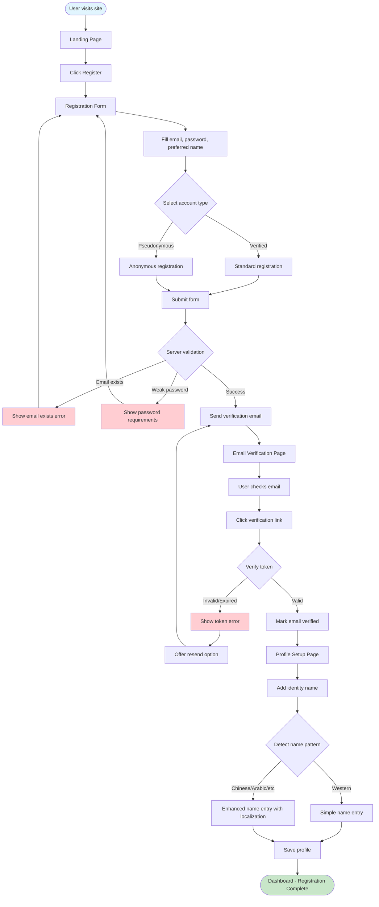
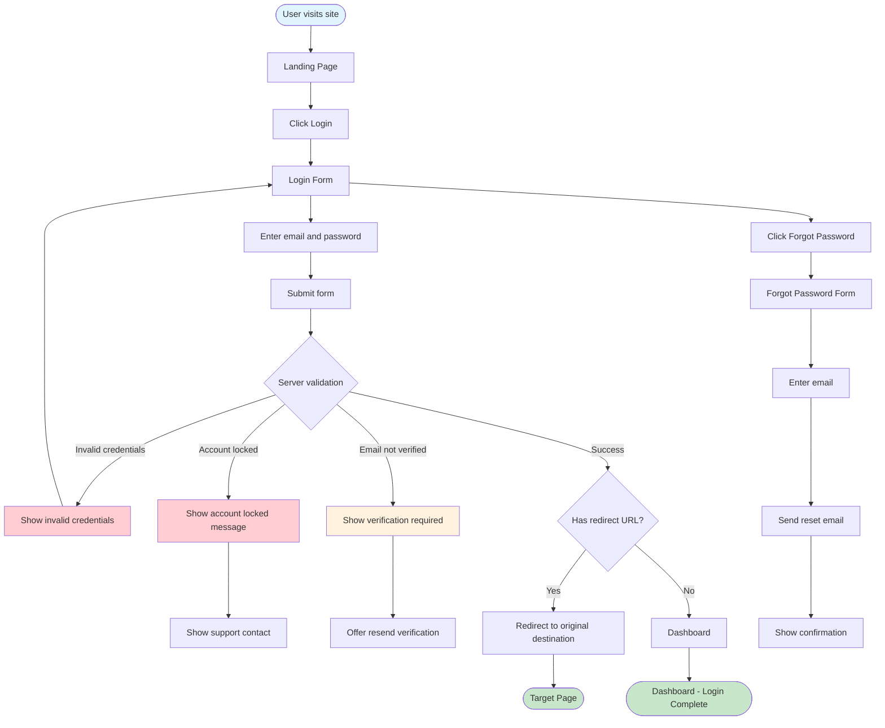
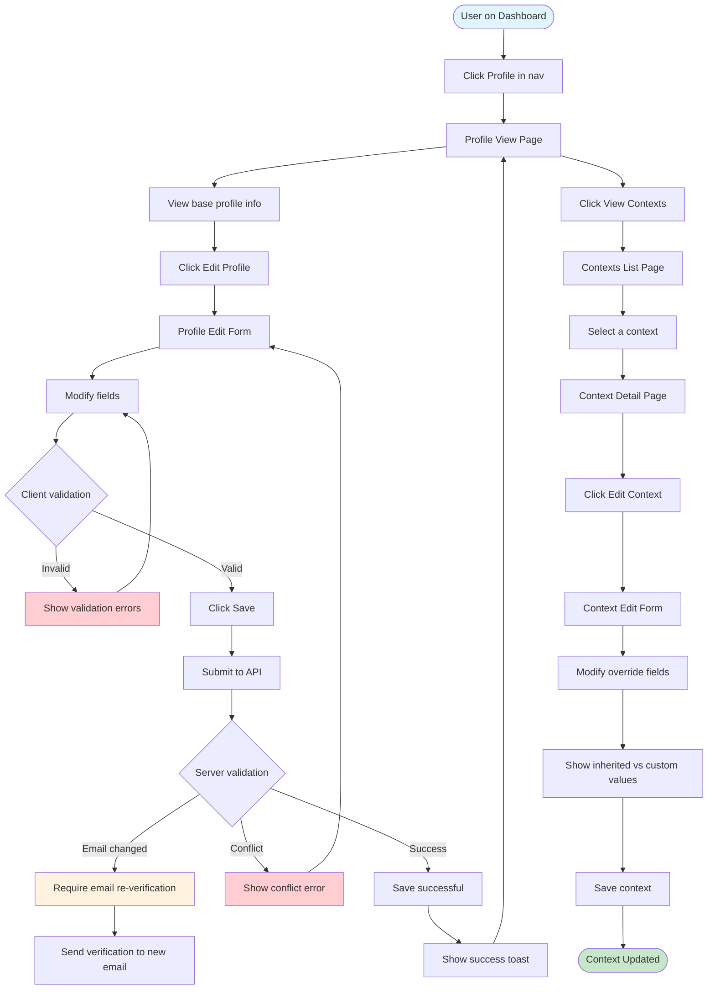

# Red Routes - Critical User Journeys

Red routes are the critical paths through the application that users must complete successfully. These journeys represent the core functionality and must be optimized for usability, accessibility, and error recovery.

## Overview

This document defines the four critical user journeys for the Identity Management application:

1. [Registration Flow](#1-registration-flow) - New user account creation
2. [Login Flow](#2-login-flow) - Returning user authentication
3. [Profile Edit Flow](#3-profile-edit-flow) - Managing identity information
4. [OAuth Consent Flow](#4-oauth-consent-flow) - Third-party authorization

Each flow includes:

- Mermaid flowchart visualization
- Step-by-step description
- API endpoint mapping
- Error states and recovery paths
- Success criteria

---

## 1. Registration Flow

**Goal**: New user creates an account and sets up their identity profile.

**Personas**: All users (Dr. Sarah Chen, Li Ming, vulnerable populations)

### Flow Diagram



### Step-by-Step Description

| Step | Page/Component | User Action | System Response | API Endpoint |
|------|----------------|-------------|-----------------|--------------|
| 1 | Landing | Click "Register" | Navigate to registration form | - |
| 2 | RegisterView | Fill email, password, confirm password, preferred name | Real-time validation feedback | - |
| 3 | RegisterView | Select account type (verified/pseudonymous) | Show type description | - |
| 4 | RegisterView | Submit form | Validate and create account | `POST /api/v1/auth/register` |
| 5 | VerifyEmailView | Wait for email | Display "check your email" message | - |
| 6 | Email | Click verification link | Navigate to verification page | - |
| 7 | VerifyEmailView | Automatic token verification | Verify email address | `POST /api/v1/auth/verify-email` |
| 8 | ProfileSetup | Enter full name | Detect naming pattern | - |
| 9 | ProfileSetup | Confirm/enhance name entry | Save profile with names | `POST /api/v1/profiles/{id}/names` |
| 10 | Dashboard | - | Show welcome message | - |

### Error States

| Error | Trigger | User Message | Recovery Action |
|-------|---------|--------------|-----------------|
| Email exists | Duplicate email | "An account with this email already exists" | Link to login or password reset |
| Weak password | Password validation | "Password must be at least 8 characters..." | Show requirements inline |
| Invalid token | Expired/invalid verification link | "This verification link has expired" | Offer to resend verification email |
| Network error | API unreachable | "Unable to connect. Please try again." | Retry button |

### Success Criteria

- User can complete registration in under 3 minutes
- Email verification link works on first click
- Profile setup accommodates all naming conventions
- Clear feedback at each step

---

## 2. Login Flow

**Goal**: Returning user authenticates and accesses their dashboard.

**Personas**: All returning users

### Flow Diagram



### Step-by-Step Description

| Step | Page/Component | User Action | System Response | API Endpoint |
|------|----------------|-------------|-----------------|--------------|
| 1 | Landing | Click "Login" | Navigate to login form | - |
| 2 | LoginView | Enter email and password | Real-time format validation | - |
| 3 | LoginView | Submit form | Authenticate user | `POST /api/v1/auth/login` |
| 4 | - | - | Store tokens, redirect | - |
| 5 | Dashboard/Target | - | Show authenticated content | - |

### Error States

| Error | Trigger | User Message | Recovery Action |
|-------|---------|--------------|-----------------|
| Invalid credentials | Wrong email/password | "Invalid email or password" | Clear password field, focus |
| Account locked | Too many failed attempts | "Account temporarily locked" | Show unlock time or support contact |
| Email not verified | Unverified account | "Please verify your email first" | Resend verification link |
| Network error | API unreachable | "Unable to connect" | Retry button |

### Success Criteria

- Login completes in under 5 seconds
- Redirect to original destination works correctly
- Session persists across browser refresh
- Clear error messages for all failure cases

---

## 3. Profile Edit Flow

**Goal**: User updates their base profile or context-specific information.

**Personas**: All authenticated users

### Flow Diagram



### Step-by-Step Description

| Step | Page/Component | User Action | System Response | API Endpoint |
|------|----------------|-------------|-----------------|--------------|
| 1 | Dashboard | Click "Profile" | Navigate to profile view | `GET /api/v1/profiles/{id}` |
| 2 | ProfileView | Click "Edit Profile" | Show edit form | - |
| 3 | ProfileEdit | Modify fields | Real-time validation | - |
| 4 | ProfileEdit | Click "Save" | Submit changes | `PATCH /api/v1/profiles/{id}` |
| 5 | ProfileView | - | Show success toast | - |
| 6 | ProfileView | Click "View Contexts" | Navigate to contexts list | `GET /api/v1/profiles/{id}/contexts` |
| 7 | ContextsList | Select context | Navigate to context detail | `GET /api/v1/profiles/{id}/contexts/{cid}` |
| 8 | ContextDetail | Click "Edit" | Show context edit form | - |
| 9 | ContextEdit | Modify overrides | Show inheritance indicators | - |
| 10 | ContextEdit | Click "Save" | Submit changes | `PATCH /api/v1/profiles/{id}/contexts/{cid}` |

### Error States

| Error | Trigger | User Message | Recovery Action |
|-------|---------|--------------|-----------------|
| Validation error | Invalid field format | Inline error message | Highlight field, show requirement |
| Email conflict | Email already in use | "This email is already registered" | Suggest different email |
| Optimistic lock | Concurrent edit | "Profile was modified. Please refresh." | Reload and merge changes |
| Network error | API unreachable | "Unable to save changes" | Retry button, preserve form data |

### Success Criteria

- Changes save within 2 seconds
- Inheritance indicators clearly show field source
- Unsaved changes warning on navigation
- Success feedback visible and accessible

---

## 4. OAuth Consent Flow

**Goal**: User authorizes a third-party application to access their identity data.

**Personas**: Dr. Sarah Chen (privacy-focused), Li Ming (multilingual)

### Flow Diagram

```mermaid
flowchart TD
    Start([Third-party app redirects]) --> AuthEndpoint[/oauth/authorize endpoint]
    
    AuthEndpoint --> ValidateClient{Validate client_id}
    
    ValidateClient -->|Invalid| ErrorClient[Show invalid client error]
    ErrorClient --> StayOnPage([Stay on error page])
    
    ValidateClient -->|Valid| CheckAuth{User authenticated?}
    
    CheckAuth -->|No| LoginRedirect[Redirect to login]
    LoginRedirect --> LoginFlow[Complete login]
    LoginFlow --> ReturnToAuth[Return to authorize]
    ReturnToAuth --> AuthEndpoint
    
    CheckAuth -->|Yes| CheckConsent{Existing consent?}
    
    CheckConsent -->|Yes, all scopes| AutoApprove[Auto-approve if remembered]
    AutoApprove --> GenerateCode[Generate auth code]
    
    CheckConsent -->|No or new scopes| ConsentScreen[Show consent screen]
    
    ConsentScreen --> DisplayApp[Show app name, logo, description]
    DisplayApp --> DisplayScopes[Show requested scopes]
    DisplayScopes --> SelectContext[Select identity context]
    
    SelectContext --> PreviewData[Preview data to be shared]
    PreviewData --> UserDecision{User decision}
    
    UserDecision -->|Deny| DenyConsent[Deny authorization]
    DenyConsent --> RedirectDeny[Redirect with error=access_denied]
    RedirectDeny --> ThirdPartyError([Third-party handles denial])
    
    UserDecision -->|Allow| GrantConsent[Grant consent]
    GrantConsent --> SaveConsent[Save consent record]
    SaveConsent --> GenerateCode
    
    GenerateCode --> RedirectSuccess[Redirect with auth code]
    RedirectSuccess --> ThirdPartyExchange([Third-party exchanges code])
    
    style Start fill:#e1f5fe
    style ThirdPartyExchange fill:#c8e6c9
    style ThirdPartyError fill:#fff3e0
    style ErrorClient fill:#ffcdd2
```

### Step-by-Step Description

| Step | Page/Component | User Action | System Response | API Endpoint |
|------|----------------|-------------|-----------------|--------------|
| 1 | - | Third-party redirects | Validate OAuth parameters | `GET /api/v1/oauth/authorize` |
| 2 | LoginView | Login if needed | Authenticate user | `POST /api/v1/auth/login` |
| 3 | ConsentView | View consent screen | Display app info and scopes | - |
| 4 | ConsentView | Select identity context | Preview data to be shared | - |
| 5 | ConsentView | Toggle optional scopes | Update preview | - |
| 6 | ConsentView | Click "Allow" or "Deny" | Process decision | `POST /api/v1/oauth/consent` |
| 7 | - | - | Redirect to third-party | - |

### Error States

| Error | Trigger | User Message | Recovery Action |
|-------|---------|--------------|-----------------|
| Invalid client | Unknown client_id | "Unknown application" | Do not redirect, show error page |
| Invalid redirect | Mismatched redirect_uri | "Invalid redirect" | Do not redirect, show error page |
| Invalid scope | Unsupported scope | "Some permissions are not available" | Show available scopes only |
| Session expired | Token expired during flow | "Session expired" | Re-authenticate and restart |

### Success Criteria

- Consent screen loads within 2 seconds
- Scopes explained in plain language
- Context preview accurately reflects shared data
- Redirect completes without user confusion

---

## API Endpoint Summary

### Authentication Endpoints

| Endpoint | Method | Description |
|----------|--------|-------------|
| `/api/v1/auth/register` | POST | Create new account |
| `/api/v1/auth/login` | POST | Authenticate user |
| `/api/v1/auth/logout` | POST | End session |
| `/api/v1/auth/refresh` | POST | Refresh access token |
| `/api/v1/auth/verify-email` | POST | Verify email address |
| `/api/v1/auth/request-password-reset` | POST | Request password reset |
| `/api/v1/auth/reset-password` | POST | Reset password with token |

### Profile Endpoints

| Endpoint | Method | Description |
|----------|--------|-------------|
| `/api/v1/profiles/{user_id}` | GET | Get base profile |
| `/api/v1/profiles/{user_id}` | PATCH | Update base profile |
| `/api/v1/profiles/{user_id}/names` | GET | Get identity names |
| `/api/v1/profiles/{user_id}/names` | POST | Add identity name |
| `/api/v1/profiles/{user_id}/contexts` | GET | List contexts |
| `/api/v1/profiles/{user_id}/contexts` | POST | Create context |
| `/api/v1/profiles/{user_id}/contexts/{id}` | GET | Get context |
| `/api/v1/profiles/{user_id}/contexts/{id}` | PATCH | Update context |
| `/api/v1/profiles/{user_id}/contexts/{id}` | DELETE | Delete context |
| `/api/v1/profiles/{user_id}/contexts/{id}/resolved` | GET | Get resolved profile |

### OAuth Endpoints

| Endpoint | Method | Description |
|----------|--------|-------------|
| `/api/v1/oauth/authorize` | GET | Authorization endpoint |
| `/api/v1/oauth/consent` | POST | Submit consent decision |
| `/api/v1/oauth/token` | POST | Token endpoint |
| `/api/v1/oauth/revoke` | POST | Revoke token |
| `/api/v1/oauth/introspect` | POST | Introspect token |
| `/api/v1/oauth/userinfo` | GET | Get user info |
| `/api/v1/oauth/consents` | GET | List user consents |
| `/api/v1/oauth/consents/{client_id}` | DELETE | Revoke consent |

---

## Design Considerations

### Privacy by Default

- Never pre-select sharing options
- Default to minimum data sharing
- Clear indication of what will be shared
- Easy access to revoke permissions

### Error Recovery

- Preserve user input on errors
- Clear, actionable error messages
- Easy path back to retry
- Support contact for unrecoverable errors

### Accessibility

- All flows keyboard navigable
- Screen reader announcements for state changes
- Focus management on page transitions
- Error messages associated with fields

### Performance

- Target < 2 second response times
- Optimistic UI updates where safe
- Loading indicators for all async operations
- Graceful degradation on slow connections
